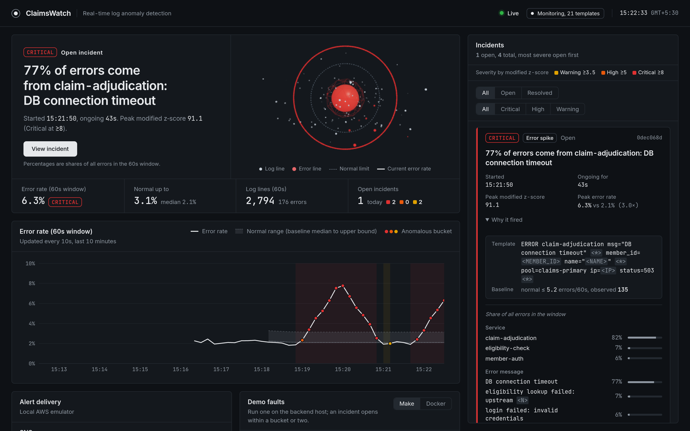
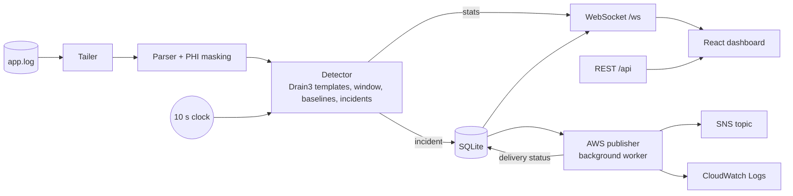

# ClaimsWatch

When a Medicaid eligibility service starts failing, the on-call engineer learns within seconds what is failing and where, before members are turned away at the pharmacy.

ClaimsWatch tails a live application log, learns what normal looks like for each kind of log line, flags statistically significant deviations with a severity level, streams them to a dashboard over WebSockets and publishes them to AWS SNS and CloudWatch Logs, with patient identifiers masked before anything leaves the parser.

Built for the Acentra Health "Build to Care" code-a-thon, problem statement PS1: Real-Time Log Anomaly Detector with Alert Feed.



[docs/media/demo.gif](docs/media/demo.gif) is a recording of the earlier dashboard design; the detection it shows is unchanged.

**Replay result:** on a 20-minute generated scenario, a database outage and a credential-stuffing attack were each detected in 10 s (1 bucket), with 0 false alarms during normal traffic (`make replay`).

## Requirements coverage

| # | Requirement | Where | How it is tested |
| --- | --- | --- | --- |
| 1 | Monitor a continuously growing log file | `backend/app/ingest/tailer.py`, `backend/app/pipeline.py` | `test_tailer.py`: append, partial lines, truncation, rotation, missing file; `test_api.py` writes to a real file and reads the result over the API |
| 2 | Rolling error rate over a sliding window | `backend/app/detection/window.py` | `test_window.py`: bucket rollover, eviction, empty window |
| 3 | Baseline for normal behaviour | `backend/app/detection/baseline.py` | `test_baseline.py`: formula, MAD floors (fixed and Poisson), zero MAD, warm-up, outlier resistance, per-template baselines and their cap |
| 4 | Detect deviations from the baseline | `backend/app/detection/detector.py`, `error_spike.py`, `templates.py` | `test_detector.py`: per-template spikes, one incident per template, guards, frozen baseline, resolution; `test_templates.py`; `test_replay.py` |
| 5 | Severity levels | `backend/app/detection/severity.py` | `test_severity.py`: every boundary; escalation in `test_detector.py` |
| 6 | Real-time frontend over WebSockets | `backend/app/api/ws.py`, `backend/app/api/routes.py`, `frontend/` | `test_ws.py`, WebSocket tests in `test_api.py`; frontend Vitest suite |
| 7 | Display alerts as they are generated | `frontend/src/components/AlertFeed.tsx`, `AlertCard.tsx` | `AlertFeed.test.tsx`, `AlertCard.test.tsx`; live demo |
| 8 | Push alerts to CloudWatch Logs or SNS | `backend/app/alerts/publisher.py` | `test_publisher.py` (moto): SNS -> SQS read-back with PHI check, CloudWatch read-back, failure handling |

Beyond the minimum: PHI masking (`ingest/masking.py`), top-contributor attribution with a one-line summary (`detection/contributors.py`), incident lifecycle with acknowledgement, per-channel delivery status on every alert, and a deterministic replay benchmark (`tools/replay.py`).

## Architecture



The backend is one FastAPI process. The detector is pure Python with no I/O, so the live pipeline and the replay benchmark run exactly the same code. See [docs/architecture.md](docs/architecture.md) for the data flow and the full REST/WebSocket contract, and [docs/decisions.md](docs/decisions.md) for why it is built this way.

**Documentation:** [docs/PROJECT_GUIDE.md](docs/PROJECT_GUIDE.md) explains the architecture, the detection maths and every file; [docs/ROADMAP.md](docs/ROADMAP.md) lists what is left to implement and further improvements.

## How detection works

No machine-learning model: every alert comes from a robust statistic that can be explained in one sentence.

1. **Templates.** Each masked line is matched to a log template with [Drain3](https://github.com/logpai/Drain3), an online log parser. Lines that differ only in request IDs, latencies or IP addresses share a template, for example `ERROR claim-adjudication msg="DB connection timeout" <*> member_id=<MEMBER_ID> ... ip=<IP> status=503 <*>`, and the varying tokens become named parameters (`source_ip=10.4.2.17`). Masking runs first, so PHI never reaches the miner or the template text. The number of templates kept in memory is capped (`MAX_TEMPLATES`).
2. **Sliding window.** Lines are counted into 10-second buckets; the window is the last six buckets (60 seconds), recomputed every 10 seconds. Error lines are counted per template as well as in total.
3. **Baseline per template.** For every error template the detector keeps the last 30 window counts seen during normal operation, and scores the current count with the modified z-score (Iglewicz and Hoaglin, 1993):

   ```
   score = 0.6745 * (x - median) / MAD
   ```

   `x` is the template's error count in the window. Median and MAD are used instead of mean and standard deviation because one past spike barely moves them. MAD is floored at `TEMPLATE_MAD_FLOOR` (1 error) and at the scatter of a Poisson count with the same median, `0.6745 * sqrt(median)`, so ordinary random arrivals in a busy template are never mistaken for a spike. A template seen for the first time starts from a history of zeros, so a brand-new failure is scored at once. Scoring starts after six learned windows, roughly two minutes after startup.
4. **Severity tiers.** WARNING when the score is at least 3.5 (the Iglewicz and Hoaglin outlier cut-off), HIGH at 5 and CRITICAL at 8 (our escalation choices). All three are configurable (`THRESHOLD_WARNING`, `THRESHOLD_HIGH`, `THRESHOLD_CRITICAL`).
5. **Minimum-count guard.** No alert unless the template has at least 5 errors in the window and the window holds at least 50 lines.
6. **Incidents.** One alert per incident, keyed by detector and template: the first anomalous bucket opens it, later ones update it in place and a higher severity escalates it. Three consecutive normal buckets resolve it. While any incident is open no baseline learns, so an outage never becomes the new normal.
7. **Explanation.** Each alert names its detector and template, the baseline band it broke (median and upper edge, in errors per 60 s), the observed count, the first masked line that crossed the band, and the dominant parameter values. The summary is one sentence, for example `74% of errors come from claim-adjudication: DB connection timeout` or `179 failed logins from 10.4.2.17 in the last 60s`, where the IP comes from the template's parameters.

The global error rate is still computed, scored against its own median and MAD, and drawn on the dashboard chart; it is the control the per-template detector is compared with, but it no longer raises alerts itself.

## Privacy

Every line is masked in the parser, before any field is extracted: member IDs become `<MEMBER_ID>`, and names, dates of birth, e-mail addresses, SSN-like numbers and phone numbers get their own tags. The database, dashboard, SNS and CloudWatch only ever see masked text, in line with HIPAA's minimum-necessary standard. Masking also normalises messages, so errors that differ only by member ID are counted together. All names and IDs produced by the log generator are random.

## AWS

`backend/app/alerts/publisher.py` is real boto3 code. Each incident sends one message when it opens, one each time it escalates and one when it resolves. Every message goes to an SNS topic and a CloudWatch Logs stream, carries an `event` field (`opened`, `escalated` or `resolved`) and has `event`, `severity` and `status` message attributes for subscription filters. The topic, log group and stream are created on startup if missing. Delivery runs in a background worker, so AWS latency never delays detection, and each alert records per-channel status (`sent` with the SNS message id, or `failed` with the error).

We had no AWS account for the event, so locally it runs against [moto](https://github.com/getmoto/moto), an AWS emulator, by setting `AWS_ENDPOINT_URL`. To use real AWS, remove `AWS_ENDPOINT_URL` and provide credentials through the usual AWS chain (environment variables, `~/.aws/credentials` or an IAM role). No code changes are needed.

To publish to the team topic, copy `.env.example` to `.env` in the repo root, delete `AWS_ENDPOINT_URL`, and set `AWS_REGION=ap-south-1`, `SNS_TOPIC_ARN`, `CW_ENABLED=false` and the two credential variables. Run `make sns-check` to send one test alert, then `make dev`. E-mail subscribers get a plain-text summary; SQS and other subscribers get the JSON document.

## Health and restarts

`GET /health` returns 200 while log ingest is working and 503 with `{"status": "degraded"}` while it is failing, so Docker and load balancers see a real outage. `GET /api/health` always answers and carries `status` (`ok` or `degraded`) and `ingest_error`, which the dashboard shows as "Monitoring degraded". If the log file disappears or cannot be read, the pipeline retries with backoff (1 s up to 30 s) instead of stopping, and after a transient read error it keeps its place in the file, so old lines are not counted twice. Incidents still open from a previous run are resolved at startup, so a restart never leaves a stale incident on screen (no "resolved" SNS message is sent for those).

## Quick start

### Docker

```bash
docker compose up --build
```

Open http://localhost:5173 (dashboard) or http://localhost:8000/docs (API). Wait about two minutes for the baseline to warm up (`baseline_warm: true` in `/api/health`), then inject incidents:

```bash
docker compose exec loggen python tools/loggen.py --incident db-outage --duration 45
docker compose exec loggen python tools/loggen.py --incident cred-stuffing --duration 30
docker compose exec loggen python tools/loggen.py --incident new-error --duration 45
docker compose exec backend python tools/sns_tail.py      # alerts as SNS delivers them
```

The stack publishes the dashboard on 5173, the API on 8000 and moto on 5000, bound to `127.0.0.1` only because the API has no login. If a port is already in use, override it:

```bash
FRONTEND_PORT=8080 BACKEND_PORT=18000 MOTO_PORT=15000 docker compose up --build
```

`docker compose down -v` stops the stack and deletes the log and alert-history volumes.

### Without Docker

Requires Python 3.11+ and Node 22+.

```bash
make install                                         # backend virtualenv + dependencies
make moto                                            # terminal 1: AWS emulator on :5000
AWS_ENDPOINT_URL=http://localhost:5000 make dev      # terminal 2: backend on :8000
make loggen                                          # terminal 3: normal traffic
cd frontend && npm install && npm run dev            # terminal 4: dashboard on :5173
```

Then `make incident-db`, `make incident-auth`, `make sns-tail` and `make feed` (the WebSocket feed in a terminal).

### Log generator and faults

`tools/loggen.py` writes traffic from five claims services with a slightly drifting 2% background error rate, plus two steady signals: `heartbeat service=<name> ok` from `eligibility-sync` and `payment-reconciler` every 5 s, and a claim flow where `claim validated claim_id=<id>` is followed 0.3 to 3 s later by `claim adjudicated claim_id=<id>` for 98% of claims. Member IDs and names are random and masked by the parser like every other line. Five faults can be injected live or in a seeded offline simulation (`loggen.simulate`). Only the first three are detected today; the silence and flow-break detectors are not written yet (see [docs/ROADMAP.md](docs/ROADMAP.md)), so use `db-outage`, `cred-stuffing` and `new-error` in a demo:

| Fault | Make target | What happens |
| --- | --- | --- |
| `db-outage` | `make incident-db` | claim-adjudication times out on its database (3 errors/s) |
| `cred-stuffing` | `make incident-auth` | one IP sends failed logins to member-auth (6 errors/s) |
| `new-error` | `make incident-new` | a never-seen `TLS certificate verification failed for payer gateway` error (0.5/s) |
| `heartbeat-stop` | `make incident-silence` | eligibility-sync stops sending heartbeats (not detected yet) |
| `flow-break` | `make incident-flow` | validated claims stop being adjudicated (not detected yet) |

The first three append their own lines. `heartbeat-stop` and `flow-break` remove lines, so they need `make loggen` running: the incident command records the fault in `logs/app.log.faults.json` until it ends, and the generator drops the affected lines meanwhile.

## Demo

[docs/demo-script.md](docs/demo-script.md) is the rehearsed three-minute walk-through: calm baseline, database outage (escalating to CRITICAL, with what broke and where), credential stuffing (CRITICAL naming the source IP), masking and SNS read-back, and the replay numbers.

## Tests

```bash
make check      # ruff lint + format check, mypy --strict, pytest
make replay     # detection latency and false alarms on a known scenario
cd frontend && npm test
```

The backend suite has one test file per module, including moto-backed AWS delivery tests and an end-to-end WebSocket test that writes lines to a real log file and receives the resulting stats and alert messages.

## Test results

| Suite | Result |
| --- | --- |
| Backend (`make check`) | 233 tests passing; ruff and mypy `--strict` clean |
| Frontend (`npm test`, Node 22) | 164 tests passing; ESLint, `tsc`, Prettier and production build clean |
| Replay (`make replay`, 48,363 lines) | DB outage detected in 10 s (1 bucket), credential stuffing in 10 s (1 bucket), 0 false alarms |

## Project structure

```
backend/
  app/
    main.py              app factory and lifespan (starts pipeline and publisher)
    config.py            all settings, from environment variables
    models.py            LogEvent, StatsPoint, Alert and their JSON shapes
    pipeline.py          tailer -> parser -> detector -> store -> WebSocket / AWS
    services.py          component wiring
    ingest/              tailer.py, parser.py, masking.py
    detection/           templates.py (Drain3), window.py, baseline.py, error_spike.py,
                         incidents.py, severity.py, contributors.py, detector.py
    alerts/              store.py (SQLite), publisher.py (SNS + CloudWatch Logs)
    api/                 routes.py (REST + /ws), ws.py (connection manager)
  tests/                 one test file per module
  Dockerfile
frontend/                React + TypeScript dashboard (see frontend/README.md)
tools/
  loggen.py              claims-platform logs, heartbeats and claim flows with five injectable faults
  replay.py              deterministic detection benchmark
  sns_tail.py            read alerts back from SNS through an SQS subscription
  watch_feed.py          print the WebSocket feed in a terminal
docs/                    architecture, decisions, demo script
docker-compose.yml       moto + backend + loggen + dashboard
```

## Configuration

All settings live in `backend/app/config.py` and can be overridden with environment variables or a `.env` file (see `.env.example`).

| Variable | Default | Meaning |
| --- | --- | --- |
| `LOG_PATH` | `logs/app.log` | Log file to follow |
| `TAIL_FROM_START` | `false` | Read existing content instead of starting at the end |
| `DB_PATH` | `claimswatch.db` | SQLite file for alert history |
| `WINDOW_SECONDS` | `60` | Sliding window length |
| `BUCKET_SECONDS` | `10` | Bucket size; one stats point per bucket |
| `BASELINE_BUCKETS` | `30` | Window rates kept in the baseline |
| `BASELINE_MIN_BUCKETS` | `6` | Samples needed before scoring starts |
| `MIN_ERRORS` | `5` | Minimum errors in the window before alerting |
| `MIN_TOTAL` | `50` | Minimum lines in the window before alerting |
| `MAD_FLOOR` | `0.002` | Lower bound on MAD |
| `THRESHOLD_WARNING` / `_HIGH` / `_CRITICAL` | `3.5` / `5` / `8` | Modified z-score thresholds |
| `RESOLVE_AFTER_BUCKETS` | `3` | Consecutive normal buckets to resolve an incident |
| `AWS_ENABLED` | `true` | Turn AWS delivery on or off |
| `AWS_ENDPOINT_URL` | unset | Emulator endpoint, e.g. `http://localhost:5000`; unset for real AWS |
| `AWS_REGION` | `us-east-1` | AWS region |
| `SNS_TOPIC_NAME` | `claimswatch-alerts` | SNS topic (created if missing) |
| `SNS_TOPIC_ARN` | unset | Existing topic to publish to; skips topic creation, so only `sns:Publish` is needed |
| `AWS_ACCESS_KEY_ID` / `AWS_SECRET_ACCESS_KEY` | unset | Credentials, read from the environment or `.env`; unset uses the normal AWS chain |
| `CW_ENABLED` | `true` | Turn CloudWatch Logs delivery off and keep SNS only |
| `CW_LOG_GROUP` / `CW_LOG_STREAM` | `/claimswatch/alerts` / `anomalies` | CloudWatch Logs destination |
| `APP_NAME` | `ClaimsWatch` | Name shown in the API and alerts |

## Frontend

The dashboard (`frontend/`, React 19, TypeScript, Vite, Recharts, and React Three Fiber for one 3D view) keeps one WebSocket open to `/ws` and re-reads `/api/health` every 5 seconds.

- **Status hero.** One sentence says whether anything is wrong: all clear, learning the baseline, an open incident with its summary, monitoring degraded, or backend unreachable. Below it are the four key numbers: the 60-second error rate, the upper edge of normal, log lines in the window and open incidents.
- **3D detector view.** Each dot is a log line flowing into the detector core, with error lines in red, at the live line rate and error share. A dashed ring marks the edge of normal and a solid ring the current error rate. The core takes the severity colour, pulses when an incident opens or escalates, and dims while ingest is degraded. It is lazy-loaded, caps the pixel ratio, stops rendering when hidden, respects `prefers-reduced-motion`, and falls back to a static SVG when WebGL is unavailable.
- **Error-rate chart.** The 60-second error rate against the learned normal band, with anomalous buckets marked.
- **Incident feed.** One card per incident, filterable by state and severity: severity as text, the detector, the one-line summary, and under "Why it fired" the template, its normal band against the observed count, the masked first bad line, and the share of errors by service, message and source IP. Each card shows SNS and CloudWatch delivery status and has an Acknowledge button.
- **Alert delivery.** Which SNS and CloudWatch target alerts go to, and whether the last alert got there.
- **Demo faults.** Copyable `make` and Docker commands for the three faults the detector catches. The backend has no API to inject faults, so they are run from a terminal.

Window length, bucket size and baseline warm-up are read from `/api/health`, so labels follow the backend configuration. A badge in the header says whether the detector is still learning its baseline or monitoring ("Monitoring, 21 templates"); until the baseline is learned, the dashboard says that no alerts can fire yet.

If the WebSocket drops, the header shows "Reconnecting" and the dashboard retries with backoff, reloading history on every reconnect, so a refresh or a backend restart never leaves a gap. Colour is only used for severity, which is always also written as text. It works down to phone widths. Requires Node 22 or newer; see [frontend/README.md](frontend/README.md) for commands and the layout of `src/`.

## How we built this

The team used AI coding assistants during development. Every module was reviewed, tested and understood by the team, and all code was written for this repository.

## Team

- Panshul Arora
- Naman Rai
- Aarati Deshmukh
- Aaditey Nim

## License

MIT, see [LICENSE](LICENSE).
