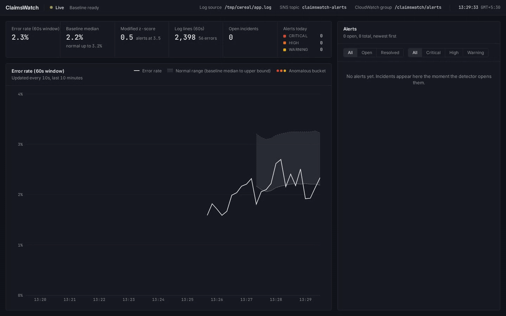

# ClaimsWatch

When a Medicaid eligibility service starts failing, the on-call engineer learns within seconds what is failing and where, before members are turned away at the pharmacy.

ClaimsWatch tails a live application log, learns what a normal error rate looks like, flags statistically significant deviations with a severity level, streams them to a dashboard over WebSockets and publishes them to AWS SNS and CloudWatch Logs, with patient identifiers masked before anything leaves the parser.

Built for the Acentra Health "Build to Care" code-a-thon, problem statement PS1: Real-Time Log Anomaly Detector with Alert Feed.



**Replay result:** on a 20-minute generated scenario, a database outage was detected in 20 s (2 buckets) and a credential-stuffing attack in 10 s (1 bucket), with 0 false alarms during normal traffic (`make replay`).

## Requirements coverage

| # | Requirement | Where | How it is tested |
| --- | --- | --- | --- |
| 1 | Monitor a continuously growing log file | `backend/app/ingest/tailer.py`, `backend/app/pipeline.py` | `test_tailer.py`: append, partial lines, truncation, rotation, missing file; `test_api.py` writes to a real file and reads the result over the API |
| 2 | Rolling error rate over a sliding window | `backend/app/detection/window.py` | `test_window.py`: bucket rollover, eviction, empty window |
| 3 | Baseline for normal behaviour | `backend/app/detection/baseline.py` | `test_baseline.py`: formula, MAD floor, zero MAD, warm-up, outlier resistance |
| 4 | Detect deviations from the baseline | `backend/app/detection/detector.py` | `test_detector.py`: spike opens one incident, guards, frozen baseline, resolution; `test_replay.py` |
| 5 | Severity levels | `backend/app/detection/severity.py` | `test_severity.py`: every boundary; escalation in `test_detector.py` |
| 6 | Real-time frontend over WebSockets | `backend/app/api/ws.py`, `backend/app/api/routes.py`, `frontend/` | `test_ws.py`, WebSocket tests in `test_api.py`; frontend Vitest suite |
| 7 | Display alerts as they are generated | `frontend/src/components/AlertFeed.tsx`, `AlertCard.tsx` | `AlertFeed.test.tsx`, `AlertCard.test.tsx`; live demo |
| 8 | Push alerts to CloudWatch Logs or SNS | `backend/app/alerts/publisher.py` | `test_publisher.py` (moto): SNS -> SQS read-back with PHI check, CloudWatch read-back, failure handling |

Beyond the minimum: PHI masking (`ingest/masking.py`), top-contributor attribution with a one-line summary (`detection/contributors.py`), incident lifecycle with acknowledgement, per-channel delivery status on every alert, and a deterministic replay benchmark (`tools/replay.py`).

## Architecture


The backend is one FastAPI process. The detector is pure Python with no I/O, so the live pipeline and the replay benchmark run exactly the same code. See [docs/architecture.md](docs/architecture.md) for the data flow and the full REST/WebSocket contract, and [docs/decisions.md](docs/decisions.md) for why it is built this way.

## How detection works

1. **Sliding window.** Log lines are counted into 10-second buckets. The error rate is errors divided by total lines over the last six buckets (60 seconds), recomputed every 10 seconds.
2. **Baseline.** The detector keeps the last 30 window error rates seen during normal operation and takes their median and median absolute deviation (MAD). It starts scoring after six samples, roughly two minutes after startup.
3. **Score.** Each new rate gets a modified z-score (Iglewicz and Hoaglin, 1993):

   ```
   score = 0.6745 * (rate - median) / max(MAD, MAD_FLOOR)
   ```

   Median and MAD are used instead of mean and standard deviation because one past spike barely moves them. The MAD floor stops a very steady service from turning tiny wobbles into huge scores.
4. **Severity.** WARNING at 3.5 (the published outlier cut-off), HIGH at 5 and CRITICAL at 8 (our escalation choices). All thresholds are configurable.
5. **Minimum-count guard.** No alert unless the window has at least 5 errors and 50 lines; 3 errors out of 5 lines is 60% but means nothing.
6. **Incidents.** The first anomalous bucket opens an incident. Later anomalous buckets update it, and a higher severity escalates it. Three consecutive normal buckets resolve it. While an incident is open the baseline is frozen, so an outage never becomes the new normal.
7. **Explanation.** Error lines in the window are counted by service, message template and source IP. The summary names the dominant cause, for example `84% of errors come from claim-adjudication: DB connection timeout` or `185 failed logins from 10.4.2.17 in the last 60s`.

## Privacy

Every line is masked in the parser, before any field is extracted: member IDs become `<MEMBER_ID>`, and names, dates of birth, e-mail addresses, SSN-like numbers and phone numbers get their own tags. The database, dashboard, SNS and CloudWatch only ever see masked text, in line with HIPAA's minimum-necessary standard. Masking also normalises messages, so errors that differ only by member ID are counted together. All names and IDs produced by the log generator are random.

## AWS

`backend/app/alerts/publisher.py` is real boto3 code. Each incident sends one message when it opens, one each time it escalates and one when it resolves. Every message goes to an SNS topic and a CloudWatch Logs stream, carries an `event` field (`opened`, `escalated` or `resolved`) and has `event`, `severity` and `status` message attributes for subscription filters. The topic, log group and stream are created on startup if missing. Delivery runs in a background worker, so AWS latency never delays detection, and each alert records per-channel status (`sent` with the SNS message id, or `failed` with the error).

We had no AWS account for the event, so locally it runs against [moto](https://github.com/getmoto/moto), an AWS emulator, by setting `AWS_ENDPOINT_URL`. To use real AWS, remove `AWS_ENDPOINT_URL` and provide credentials through the usual AWS chain (environment variables, `~/.aws/credentials` or an IAM role). No code changes are needed.

## Quick start

### Docker

```bash
docker compose up --build
```

Open http://localhost:5173 (dashboard) or http://localhost:8000/docs (API). Wait about two minutes for the baseline to warm up, then inject incidents:

```bash
docker compose exec loggen python tools/loggen.py --incident db-outage --duration 45
docker compose exec loggen python tools/loggen.py --incident cred-stuffing --duration 30
docker compose exec loggen python tools/loggen.py --incident new-error --duration 45
docker compose exec loggen python tools/loggen.py --incident heartbeat-stop --duration 60
docker compose exec loggen python tools/loggen.py --incident flow-break --duration 60
docker compose exec backend python tools/sns_tail.py      # alerts as SNS delivers them
```

### Without Docker

Requires Python 3.11+ and Node 22+.

```bash
make install                                         # backend virtualenv + dependencies
make moto                                            # terminal 1: AWS emulator on :5000
AWS_ENDPOINT_URL=http://localhost:5000 make dev      # terminal 2: backend on :8000
make loggen                                          # terminal 3: normal traffic
cd frontend && npm install && npm run dev            # terminal 4: dashboard on :5173
```

Then `make incident-db`, `make incident-auth`, `make sns-tail` and `make feed` (the WebSocket feed in a terminal).

### Log generator and faults

`tools/loggen.py` writes traffic from five claims services with a slightly drifting 2% background error rate, plus two steady signals: `heartbeat service=<name> ok` from `eligibility-sync` and `payment-reconciler` every 5 s, and a claim flow where `claim validated claim_id=<id>` is followed 0.3 to 3 s later by `claim adjudicated claim_id=<id>` for 98% of claims. Member IDs and names are random and masked by the parser like every other line. Five faults can be injected live or in a seeded offline simulation (`loggen.simulate`):

| Fault | Make target | What happens |
| --- | --- | --- |
| `db-outage` | `make incident-db` | claim-adjudication times out on its database (3 errors/s) |
| `cred-stuffing` | `make incident-auth` | one IP sends failed logins to member-auth (6 errors/s) |
| `new-error` | `make incident-new` | a never-seen `TLS certificate verification failed for payer gateway` error (0.5/s) |
| `heartbeat-stop` | `make incident-silence` | eligibility-sync stops sending heartbeats |
| `flow-break` | `make incident-flow` | validated claims stop being adjudicated |

The first three append their own lines. `heartbeat-stop` and `flow-break` remove lines, so they need `make loggen` running: the incident command records the fault in `logs/app.log.faults.json` until it ends, and the generator drops the affected lines meanwhile.

## Demo

[docs/demo-script.md](docs/demo-script.md) is the rehearsed three-minute walk-through: calm baseline, database outage (escalating to CRITICAL, with what broke and where), credential stuffing (CRITICAL naming the source IP), masking and SNS read-back, and the replay numbers.

## Tests

```bash
make check      # ruff lint + format check, mypy --strict, pytest
make replay     # detection latency and false alarms on a known scenario
cd frontend && npm test
```

The backend suite has one test file per module, including moto-backed AWS delivery tests and an end-to-end WebSocket test that writes lines to a real log file and receives the resulting stats and alert messages.

## Test results

| Suite | Result |
| --- | --- |
| Backend (`make check`) | 150 tests passing; ruff and mypy `--strict` clean |
| Frontend (`npm test`, Node 22) | 87 tests passing; ESLint, `tsc`, Prettier and production build clean |
| Replay (`make replay`, 48,363 lines) | DB outage detected in 20 s (2 buckets), credential stuffing in 10 s (1 bucket), 0 false alarms |

## Project structure

```
backend/
  app/
    main.py              app factory and lifespan (starts pipeline and publisher)
    config.py            all settings, from environment variables
    models.py            LogEvent, StatsPoint, Alert and their JSON shapes
    pipeline.py          tailer -> parser -> detector -> store -> WebSocket / AWS
    services.py          component wiring
    ingest/              tailer.py, parser.py, masking.py
    detection/           window.py, baseline.py, severity.py, contributors.py, detector.py
    alerts/              store.py (SQLite), publisher.py (SNS + CloudWatch Logs)
    api/                 routes.py (REST + /ws), ws.py (connection manager)
  tests/                 one test file per module
  Dockerfile
frontend/                React + TypeScript dashboard (see frontend/README.md)
tools/
  loggen.py              claims-platform logs, heartbeats and claim flows with five injectable faults
  replay.py              deterministic detection benchmark
  sns_tail.py            read alerts back from SNS through an SQS subscription
  watch_feed.py          print the WebSocket feed in a terminal
docs/                    architecture, decisions, demo script
docker-compose.yml       moto + backend + loggen + dashboard
```

## Configuration

All settings live in `backend/app/config.py` and can be overridden with environment variables or a `.env` file (see `.env.example`).

| Variable | Default | Meaning |
| --- | --- | --- |
| `LOG_PATH` | `logs/app.log` | Log file to follow |
| `TAIL_FROM_START` | `false` | Read existing content instead of starting at the end |
| `DB_PATH` | `claimswatch.db` | SQLite file for alert history |
| `WINDOW_SECONDS` | `60` | Sliding window length |
| `BUCKET_SECONDS` | `10` | Bucket size; one stats point per bucket |
| `BASELINE_BUCKETS` | `30` | Window rates kept in the baseline |
| `BASELINE_MIN_BUCKETS` | `6` | Samples needed before scoring starts |
| `MIN_ERRORS` | `5` | Minimum errors in the window before alerting |
| `MIN_TOTAL` | `50` | Minimum lines in the window before alerting |
| `MAD_FLOOR` | `0.002` | Lower bound on MAD |
| `THRESHOLD_WARNING` / `_HIGH` / `_CRITICAL` | `3.5` / `5` / `8` | Modified z-score thresholds |
| `RESOLVE_AFTER_BUCKETS` | `3` | Consecutive normal buckets to resolve an incident |
| `AWS_ENABLED` | `true` | Turn AWS delivery on or off |
| `AWS_ENDPOINT_URL` | unset | Emulator endpoint, e.g. `http://localhost:5000`; unset for real AWS |
| `AWS_REGION` | `us-east-1` | AWS region |
| `SNS_TOPIC_NAME` | `claimswatch-alerts` | SNS topic (created if missing) |
| `CW_LOG_GROUP` / `CW_LOG_STREAM` | `/claimswatch/alerts` / `anomalies` | CloudWatch Logs destination |
| `APP_NAME` | `ClaimsWatch` | Name shown in the API and alerts |

## Frontend

The dashboard (`frontend/`, React + TypeScript) keeps one WebSocket open to `/ws`. It plots the 60-second error rate against the learned normal band and shows each incident as a card: a text severity label, the detector that fired, a one-line summary of what broke and where, the log template with its normal band against the observed value and the top extracted parameters, the top services, messages and source IPs, the masked first bad line and sample log lines, SNS and CloudWatch delivery status with the SNS message ID, and an Acknowledge button. If the connection drops, a banner says the data is stale and the dashboard reconnects with backoff, reloading history each time, so a refresh or a backend restart never leaves a gap. Colour is used only for severity, which is always also written as text.

Window length, bucket size and baseline warm-up are read from `/api/health`, so the labels follow the backend configuration. A neutral badge in the header says whether the detector is still learning its baseline ("Learning baseline, 4 of 6 buckets") or monitoring ("Monitoring, 38 templates"), from the `learning` object on each stats bucket, or from `/api/health` before the first bucket arrives; until the baseline is learned, the dashboard says that no alerts can fire yet. The frontend requires Node 22 or newer; see [frontend/README.md](frontend/README.md) for commands and structure.

## How we built this

The team used AI coding assistants during development. Every module was reviewed, tested and understood by the team, and all code was written for this repository.

## Team

- Panshul Arora
- Naman Rai
- Aarati Deshmukh
- Aaditey Nim

## License

MIT, see [LICENSE](LICENSE).
