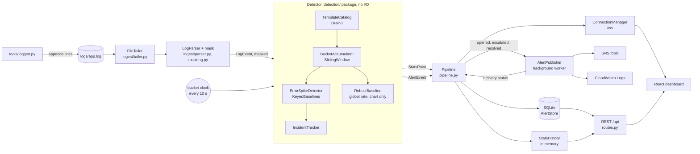

# ClaimsWatch project guide

This guide describes what is implemented on `main` as of commit `c8cb456` (28 September 2026). The code has not changed since `668521b` (PR #34); later commits only added documentation, so the measurements below, taken on `668521b`, apply unchanged. It is written so that every team member can explain each part of the system and each file to the judges. Every number in it comes either from the code and configuration or from a command we ran; commands are named next to the numbers.

Team: Panshul Arora, Naman Rai, Aarati Deshmukh, Aaditey Nim.

Contents

1. [What we built and why](#1-what-we-built-and-why)
2. [Requirements map](#2-requirements-map)
3. [Architecture](#3-architecture)
4. [Life of one log line](#4-life-of-one-log-line)
5. [Detection explained](#5-detection-explained)
6. [File-by-file reference](#6-file-by-file-reference)
7. [API and WebSocket contract](#7-api-and-websocket-contract)
8. [AWS delivery](#8-aws-delivery)
9. [Frontend](#9-frontend)
10. [How to run](#10-how-to-run)
11. [Demo script](#11-demo-script)
12. [Testing and results](#12-testing-and-results)
13. [Design decisions and trade-offs](#13-design-decisions-and-trade-offs)
14. [Likely judge questions](#14-likely-judge-questions)
15. [References](#15-references)

---

## 1. What we built and why

**Problem statement PS1, Real-Time Log Anomaly Detector with Alert Feed** (Acentra Health "Build to Care" code-a-thon). The task is to watch a live application log, learn what normal error behaviour looks like, detect significant deviations, grade them by severity, show them on a real-time dashboard as they happen, and push them to AWS (CloudWatch Logs or SNS).

**Who it is for.** The on-call engineer who runs services behind a state Medicaid programme: eligibility checks, claim adjudication, member login, provider directory and provider payments. When one of these fails, members can be turned away at a pharmacy or a provider can go unpaid. The engineer needs to know what failed and where within seconds, without reading raw logs, and without patient data leaving the server.

**Pitch.** ClaimsWatch follows a growing log file, masks patient identifiers in every line before anything else touches it, groups lines into templates with Drain3, and learns each error template's normal count per minute using the median and median absolute deviation. When a template's count moves far outside its normal band, it opens one incident with a severity level and a one-sentence explanation (for example `179 failed logins from 10.4.2.17 in the last 60s`), streams it to a React dashboard over a WebSocket, stores it in SQLite and publishes it to Amazon SNS and CloudWatch Logs from a background worker. It runs on a laptop with no AWS account by using the moto AWS emulator, and switches to real AWS by removing one environment variable.

---

## 2. Requirements map

| # | PS1 requirement | Files | Key function or class | Tests |
| --- | --- | --- | --- | --- |
| 1 | Monitor a continuously growing log file | `backend/app/ingest/tailer.py`, `backend/app/pipeline.py` | `FileTailer.read_lines`, `FileTailer.follow`, `Pipeline._ingest_loop` | `test_tailer.py` (append, partial line, truncation, rotation, missing file, invalid UTF-8); `test_api.py` writes to a real file and reads the result over the API |
| 2 | Rolling error rate over a sliding window | `backend/app/detection/window.py` | `BucketAccumulator`, `SlidingWindow.error_rate`, `SlidingWindow.template_errors` | `test_window.py`; `test_detector.py::test_stats_point_reports_window_totals` |
| 3 | Baseline for normal behaviour | `backend/app/detection/baseline.py` | `RobustBaseline`, `KeyedBaselines` | `test_baseline.py` (formula, both MAD floors, warm-up, outlier resistance, zero-history for new keys, key cap) |
| 4 | Detect deviations from the baseline | `backend/app/detection/error_spike.py`, `templates.py`, `detector.py`, `incidents.py` | `ErrorSpikeDetector.evaluate`, `TemplateCatalog.match`, `Detector.close_bucket`, `IncidentTracker.advance` | `test_detector.py`, `test_templates.py`, `test_incidents.py`, `test_replay.py` |
| 5 | Severity levels | `backend/app/detection/severity.py` | `classify`, `SeverityThresholds` | `test_severity.py` (every boundary); escalation in `test_detector.py::test_moderate_rise_is_high_then_escalates_to_critical` |
| 6 | Frontend over WebSocket or polling | `backend/app/api/ws.py`, `backend/app/api/routes.py`, `frontend/src/hooks/useAlertStream.ts` | `ConnectionManager.broadcast`, `websocket_feed`, `useAlertStream` | `test_ws.py`; WebSocket tests in `test_api.py`; `useAlertStream.test.tsx`, `alertStreamReducer.test.ts` |
| 7 | Display alerts as they are generated | `frontend/src/components/AlertFeed.tsx`, `AlertCard.tsx` | `AlertFeed`, `AlertCard`, reducer action `message` | `AlertFeed.test.tsx`, `AlertCard.test.tsx` |
| 8 | Push alerts to CloudWatch Logs or SNS | `backend/app/alerts/publisher.py` | `AlertPublisher.deliver`, `_publish_sns`, `_put_log_event` | `test_publisher.py` (moto: SNS to SQS read-back, CloudWatch read-back, failure handling); `test_pipeline.py::test_incident_lifecycle_reaches_sns_as_three_messages_in_order`; `test_api.py::test_phi_never_reaches_the_store_the_feed_or_aws` |

We implement both SNS and CloudWatch Logs for requirement 8, and a WebSocket (not polling) for requirement 6.

---

## 3. Architecture



Everything on the backend runs in one FastAPI process (`uvicorn app.main:app`). Two coroutines share one event loop: the ingest loop and the bucket clock (`Pipeline.run`). AWS calls run in a worker thread through `asyncio.to_thread`.

**Layering rule.** The `backend/app/detection/` package never imports FastAPI, Starlette, uvicorn, boto3 or botocore, and does no file or network I/O. Time only advances when the caller calls `Detector.close_bucket(end)`. This rule is enforced by a test, `test_detector.py::test_detection_package_has_no_web_or_cloud_dependencies`, which parses every file in the package with `ast` and fails on any of those imports. (The package does import `drain3`, a pure-Python library, and `app.config`/`app.models`.)

Why:

* The live pipeline closes buckets on the wall clock; `tools/replay.py` closes them on timestamps in a generated log. Because the detector has no I/O, both run exactly the same detection code, so the replay numbers in section 12 describe the real detector.
* Detection can be unit-tested with plain objects: no server, no emulator, no sleeping.
* AWS or the web layer can change (or fail) without touching detection logic.

---

## 4. Life of one log line

This follows one line of a database outage from the generator to the dashboard and AWS.

1. **Written.** `tools/loggen.py --incident db-outage` calls `write_forever`, which once per second builds that second's lines with `incident_second` and `LineFactory.incident("db-outage", ts)` and appends them to `logs/app.log`:

   ```
   2026-09-28T09:08:01.591Z ERROR claim-adjudication msg="DB connection timeout" req=c89f9aaa member_id=M1234567 name="Maria Lopez" plan=MEDICAID-A pool=claims-primary ip=10.2.135.80 status=503 latency_ms=5167
   ```

   (Member ID and name here are illustrative; loggen generates random ones.)

2. **Tailed.** `FileTailer.follow` calls `read_lines` every `TAIL_POLL_SECONDS` (0.25 s). `read_lines` stats the path and:
   * on the first open, seeks to the end unless `TAIL_FROM_START=true`, like `tail -f`;
   * if the inode changed (rotation), drains the rest of the old file, closes it and opens the new file from byte 0;
   * if the file is shorter than the saved offset (truncation), `_restart_after_truncation` seeks to 0;
   * if the file does not exist yet, returns nothing and reads it from the start when it appears.

   `_drain` reads to end of file and splits on `\n`; a trailing partial line is kept in `_partial` until its newline arrives. Bytes are decoded as UTF-8 with `errors="replace"`.

3. **Parsed and masked.** `Pipeline._ingest_loop` passes each line to `LogParser.parse`. The whole line is first passed through `mask()` in `ingest/masking.py`, so `member_id=M1234567` becomes `member_id=<MEMBER_ID>` and `name="Maria Lopez"` becomes `name="<NAME>"` before any field is extracted. `_parse_masked` then matches timestamp, level and service with a regex, extracts `key=value` fields with `parse_fields`, and builds a `LogEvent` whose `message` is `message_template(msg)` (masked, with free-standing numbers replaced by `<N>`), whose `raw` is the masked line, and whose `source_ip` and `http_status` come from `ip`/`status`. Lines that do not match are counted in `LogParser.malformed` and skipped.

4. **Templated and counted.** `Detector.observe(event)` calls `TemplateCatalog.match(event.raw)`. Drain3 mines the line without its timestamp and returns a template id and text such as
   `ERROR claim-adjudication msg="DB connection timeout" <*> member_id=<MEMBER_ID> name="<NAME>" <*> pool=claims-primary ip=<IP> status=503 <*>`
   plus named parameters (for example `source_ip=10.2.135.80`). The event is copied with `template_id` and `params` set and added to the open bucket by `BucketAccumulator.add`, which counts every line and keeps error lines (levels `ERROR`, `FATAL`, `CRITICAL`) for attribution.

5. **Bucket clock.** `Pipeline._clock_loop` computes the next 10-second wall-clock edge with `_next_boundary` (never one already closed; missed edges after a stall are skipped), sleeps with `_sleep_until` (which re-checks the clock because timers can wake early), then calls `Pipeline.close_bucket(end)`.

6. **Window.** `Detector.close_bucket` closes the accumulator into a `Bucket` and pushes it into `SlidingWindow` (6 buckets = 60 s by default). The window gives `total`, `errors`, `error_rate` and `template_errors()`, a count of error lines per template id.

7. **Baselines and detector.** `ErrorSpikeDetector.evaluate` walks every template that has errors in the window. For each it calls `KeyedBaselines.touch(template_id, history_length)`, which returns that template's `RobustBaseline` (creating one pre-filled with zeros if the template is new), scores the count with `RobustBaseline.score`, applies the guards (template count ≥ `MIN_ERRORS`, window total ≥ `MIN_TOTAL`), and maps the score to a severity with `classify`. Each anomalous template becomes a `Finding` with an `Explanation` (detector, template, baseline band, observed count, first bad line, parameters), a summary sentence, top contributors and sample lines. Separately, the global error rate is scored against its own `RobustBaseline` for the chart.

8. **Incident.** `IncidentTracker.advance` keys each finding as `error_spike:<template id>`. A new key opens an incident (`AlertChange.OPENED`); an existing key updates it, escalates it if the severity rank rose (`ESCALATED`), and refreshes the figures when the score is a new peak (`_record_peak`, which keeps the original first bad line). Open incidents without a finding count normal buckets; after `RESOLVE_AFTER_BUCKETS` (3) in a row they resolve (`RESOLVED`). Each change is returned as an `AlertEvent` holding a deep copy of the alert.

9. **Learning or frozen.** Back in `Detector.close_bucket`: only if the window is full, not empty, nothing changed in this bucket and no incident is open do the global baseline (`_rate_baseline.update`) and every tracked template baseline (`ErrorSpikeDetector.learn`) learn. During an incident all baselines are frozen. The method returns a `DetectionResult(stats, alert_events)`; the `StatsPoint` includes a `learning` object.

10. **Store and broadcast.** `Pipeline.close_bucket` appends the `StatsPoint` to `StatsHistory` and broadcasts `{"type": "stats", ...}`. For each alert event, `_handle_alert` sets delivery to `pending` (or `disabled` if AWS is off), saves it with `AlertStore.save_detection` (an upsert; with `reset_delivery=True` for opened, escalated and resolved), and broadcasts `{"type": "alert", ...}`. For opened, escalated and resolved (not plain updates) it calls `AlertPublisher.submit`.

11. **Dashboard.** In the browser, `useAlertStream` receives the frame, `parseWsMessage` validates it, and `alertStreamReducer` merges it (`mergeStats` by timestamp, `upsertAlert` by id, never letting an older `updated_at` overwrite a newer one). `ErrorRateChart` redraws, and a new alert slides into `AlertFeed` as an `AlertCard`.

12. **AWS, in the background.** `submit` only puts the event on an `asyncio.Queue` and returns. The worker `_run` calls `deliver` in a thread: `_publish_sns` publishes the JSON from `alert_message` with a subject from `sns_subject` and message attributes `event`, `severity`, `status`; `_put_log_event` writes the same JSON to the CloudWatch stream. Each channel succeeds or fails independently. The result goes to `Pipeline.record_delivery`, which stores it with `AlertStore.set_delivery` and broadcasts the updated alert, so the card's SNS chip changes from pending to sent with the message id. If a newer transition of the same alert was queued in the meantime, the older result is not reported, so it cannot overwrite the newer pending state.

---

## 5. Detection explained

All numbers below are the defaults in `backend/app/config.py` (also listed in `.env.example`); each can be changed with an environment variable of the same name in upper case.

| Setting | Default | Used for |
| --- | --- | --- |
| `BUCKET_SECONDS` | 10 | Bucket length; one stats point per bucket |
| `WINDOW_SECONDS` | 60 | Window length (6 buckets) |
| `BASELINE_BUCKETS` | 30 | Values kept in each baseline |
| `BASELINE_MIN_BUCKETS` | 6 | Values needed before scoring |
| `MAD_FLOOR` | 0.002 | MAD floor for the global error rate (chart) |
| `TEMPLATE_MAD_FLOOR` | 1.0 | MAD floor for per-template error counts (alerting) |
| `MIN_ERRORS` | 5 | Minimum errors of the template in the window |
| `MIN_TOTAL` | 50 | Minimum lines in the window |
| `THRESHOLD_WARNING` / `HIGH` / `CRITICAL` | 3.5 / 5.0 / 8.0 | Severity cut-offs |
| `RESOLVE_AFTER_BUCKETS` | 3 | Normal buckets before an incident resolves |
| `MAX_TEMPLATES` | 500 | Cap on Drain3 clusters and on per-template baselines |
| `TEMPLATE_SIMILARITY` | 0.5 | Drain3 similarity threshold |

### Sliding window and buckets

Lines are counted into the open bucket. Every 10 s the bucket closes and joins a window of the last 6 buckets, and the oldest bucket drops out (`SlidingWindow`, a `deque(maxlen=6)`). So the numbers refresh every 10 s but always describe the last full minute. A window with no lines has no error rate (`None`, not 0%): nothing is scored or learned, and the chart shows a gap.

### Templates (Drain3)

`TemplateCatalog` wraps Drain3's `TemplateMiner` with depth 5 so that the level and the service are the first two tokens the tree routes on; lines from different services or levels never share a template. IPv4 addresses are masked by Drain3 as `<IP>` so the IP is always available as a named parameter (`source_ip`). Drain3 only ever sees lines that `mask()` has already processed (`test_templates.py::test_masked_phi_never_reaches_template_text_or_parameters`).

### Baseline: median and MAD

`RobustBaseline` keeps the last 30 values of one signal and computes:

* median of the values;
* MAD, the median of `|value − median|`;
* modified z-score (Iglewicz and Hoaglin, 1993):

  ```
  score = 0.6745 × (x − median) / MAD
  ```

  0.6745 rescales MAD so that, for normally distributed data, the score is comparable to an ordinary z-score (MAD ≈ 0.6745 σ);
* the upper edge of normal, `upper_band(threshold) = median + threshold × MAD / 0.6745`, the value at which the score reaches the WARNING threshold.

No score is produced until 6 values exist.

**Two signals use this class.**

* **Alerting signal, per template.** `KeyedBaselines` holds one `RobustBaseline` per error template, with `counts=True`. `x` is the template's error count in the window. MAD is floored at `max(TEMPLATE_MAD_FLOOR, 0.6745 × √median)`. The second term is the MAD of a Poisson count with that median: random arrivals scatter a count by that much, and consecutive windows share 5 of their 6 buckets, so the MAD measured over them understates the scatter. A template seen for the first time is created with a history of zeros as long as the history learned so far (capped at 30), because its count in every earlier window was zero; a brand-new failure is therefore scored at once. At most `MAX_TEMPLATES` baselines are kept; the least recently touched is evicted.
* **Chart signal, global.** `Detector._rate_baseline` scores the global error rate with `MAD_FLOOR` (0.002). It feeds `baseline_median`, `band_upper` and `score` in each `StatsPoint`, and the learning progress. It no longer raises alerts; it is kept as the control for a comparison with the per-template detector.

**MAD floor, why.** If a service is perfectly steady, MAD is 0 and every tiny change would score infinitely high. `test_baseline.py::test_zero_mad_is_clamped_to_floor_instead_of_dividing_by_zero` covers this.

### Guards

A template can only be anomalous if it has at least `MIN_ERRORS` (5) errors in the window and the window has at least `MIN_TOTAL` (50) lines. A few errors in a quiet minute can produce an extreme score that means nothing.

### Severity

`classify(score)` returns nothing below 3.5, `WARNING` from 3.5, `HIGH` from 5 and `CRITICAL` from 8. 3.5 is the outlier cut-off recommended by Iglewicz and Hoaglin; 5 and 8 are our own escalation choices. `SeverityThresholds` rejects values that are not strictly increasing. An incident's severity is the highest reached; it never goes down. A `StatsPoint`'s `severity` is the highest severity of any finding in that bucket.

### Incidents, frozen baseline and resolution

`IncidentTracker` produces one alert per incident key (`error_spike:<template id>`), so one outage is one alert that updates in place, and two unrelated templates failing at once get two alerts (`test_detector.py::test_each_template_gets_its_own_incident`). While any incident is open no baseline learns (`test_baseline_is_frozen_while_incident_is_open`). An incident resolves after 3 consecutive buckets without a finding for its key; a finding resets the count (`test_incidents.py::test_a_finding_resets_the_normal_streak`).

### Explanation and contributors (`detection/contributors.py`)

* **Summary.** `summarise(template_events, error_count, window_seconds)`. If one source IP (a Drain3 parameter) accounts for at least 40% (`DOMINANT_IP_SHARE`) of the template's lines, the summary names it: `"<n> failed logins from <ip> in the last 60s"` when more than half of that IP's lines have HTTP status 401 or 403, otherwise `"<n> errors from <ip> in the last 60s: <message>"`. Otherwise it reads `"<p>% of errors come from <service>: <message>"`, where `p` is this template's share of all error lines in the window.
* **Top contributors.** `top_contributors` ranks all error lines in the window by service, message and source IP (top 3 each, with count and share).
* **Parameters.** `top_params` keeps, for each parameter name, the most common value if it appears on at least 2 lines and at least half (`PARAM_MIN_SHARE`) of the template's lines, so request ids and latencies never show.
* **Sample lines.** Up to 5 masked lines, newest first, with lines of the dominant message first.
* **First bad line.** In the window's lines for the template (oldest first), the line at index `int(upper band)`: the line at which the count first exceeded the band.

### Worked example (real run, default config)

From `tools/replay.py`'s default scenario (seed 2026), bucket ending 490 s into the scenario, 10 s after the database outage started. The template `ERROR claim-adjudication msg="DB connection timeout" ...` had never appeared, so its baseline is 30 zeros.

* median = 0, raw MAD = 0
* MAD floor = max(1.0, 0.6745 × √0) = 1.0
* observed x = 30 errors in the window; window total = 2,402 lines, so both guards pass (30 ≥ 5, 2,402 ≥ 50)
* score = 0.6745 × (30 − 0) / 1.0 = 20.23, which is ≥ 8, so **CRITICAL**
* band upper = 0 + 3.5 × 1.0 / 0.6745 = 5.19 errors per 60 s
* first bad line = the 6th DB timeout line in the window (index `int(5.19)` = 5)

For a never-seen template at these defaults, 5 errors score 3.37 (no alert), 6 score 4.05 (WARNING), 8 score 5.40 (HIGH) and 12 score 8.09 (CRITICAL).

In the same bucket the global error rate was 0.0321 against a median of 0.0222 with MAD at its 0.002 floor: 0.6745 × (0.0321 − 0.0222) / 0.002 = 3.34, below 3.5. The old global detector would not have alerted in this bucket; the per-template detector did. These figures were printed by a short script that runs the replay scenario through `Detector` and prints each `StatsPoint` and the opened alert (the alert JSON in section 7 comes from the same run).

---

## 6. File-by-file reference

### Backend application (`backend/app/`)

| File | What it does | Key names |
| --- | --- | --- |
| `__init__.py` | Package docstring and `__version__ = "0.1.0"`, shown in the OpenAPI page. | `__version__` |
| `main.py` | FastAPI app factory. The lifespan handler builds the services, starts the AWS publisher (which creates the topic, log group and stream), starts the pipeline as a background task, and on shutdown cancels it and closes the database and log file. Adds CORS for `CORS_ORIGINS`. | `create_app`, `app` |
| `config.py` | Every tunable value, read once from environment variables or `.env` with pydantic-settings, with validation (for example `bucket_seconds > 0`). | `Settings`, `get_settings`, `Settings.buckets_per_window` |
| `models.py` | Domain objects and their JSON shapes: `LogEvent`, `StatsPoint`, `LearningState`, `Alert`, `Explanation`, `TemplateRef`, `BaselineBand`, `ParamValue`, `Contributor`, `TopContributors`, `Delivery`. Timestamps are serialised as UTC with a trailing `Z`. `Alert.to_dict` merges the explanation fields into the alert JSON. | `to_dict`/`from_dict`, `Severity.rank`, `LogEvent.is_error`, `to_iso` |
| `services.py` | Wires the long-lived components together from settings and connects the publisher's `on_delivery` callback to `Pipeline.record_delivery`. | `Services`, `build_services` |
| `pipeline.py` | Runs the ingest loop and the bucket clock on one event loop and routes results to the stats history, SQLite, WebSocket clients and the AWS sink. Only `opened`, `escalated` and `resolved` go to AWS. | `Pipeline`, `run`, `close_bucket`, `_handle_alert`, `record_delivery`, `acknowledge`, `_clock_loop`, `_next_boundary`, `_sleep_until`, `PUBLISHED_CHANGES`, `AlertSink` |
| `ingest/tailer.py` | Follows a growing file like `tail -F` by polling: appended data, partial lines, truncation, rotation (inode change) and a missing file. | `FileTailer.read_lines`, `follow`, `offset` |
| `ingest/masking.py` | Regular expressions that replace PHI with tags: `name=`, `dob=`/`date_of_birth=`, `member_id=`, bare `M` + 7 digits, e-mail, SSN (3-2-4), US phone numbers (formatted, `+1`-prefixed or `phone=`/`mobile=` keys). `message_template` also replaces free-standing numbers with `<N>` for grouping. | `mask`, `message_template`, `_PHONE` |
| `ingest/parser.py` | Masks the whole line, then parses `timestamp LEVEL service key=value ...` into a `LogEvent`. Normalises level aliases (`WARNING`→`WARN`, `ERR`→`ERROR`, `CRIT`→`CRITICAL`); counts malformed lines instead of raising. | `LogParser.parse`, `parse_fields`, `parsed`, `malformed` |
| `detection/config.py` | Frozen dataclass of detector settings, built from `Settings`. | `DetectorConfig`, `from_settings`, `window_seconds` |
| `detection/templates.py` | Drain3 wrapper: mines templates online from masked lines (timestamp dropped), names parameters from `key=value` tokens, maps `ip`/`client_ip` to `source_ip`. | `TemplateCatalog.match`, `TemplateCatalog.count`, `TemplateCatalog.text`, `TemplateMatch`, `line_content` |
| `detection/window.py` | Open bucket, closed buckets and the sliding window; counts totals, errors and errors per template. | `BucketAccumulator`, `Bucket`, `SlidingWindow` (`error_rate`, `template_errors`, `error_events`, `is_full`) |
| `detection/baseline.py` | Rolling median and MAD, modified z-score, MAD floors (fixed and Poisson for counts), upper band; one baseline per key with zero history for new keys and an LRU cap. | `RobustBaseline`, `KeyedBaselines`, `MAD_SCALE = 0.6745` |
| `detection/severity.py` | Score to severity. | `SeverityThresholds`, `classify` |
| `detection/error_spike.py` | The only detector on `main`: scores each template's error count against its own baseline and builds findings with explanations. | `ErrorSpikeDetector.evaluate`, `learn`, `_finding`, `NAME = "error_spike"` |
| `detection/incidents.py` | Incident lifecycle shared by detectors: open, update, escalate, resolve, keyed by detector and template. | `IncidentTracker.advance`, `Finding`, `AlertEvent`, `AlertChange`, `WindowContext` |
| `detection/contributors.py` | Explains an incident: summary sentence, top services/messages/IPs, dominant parameters, sample lines. | `summarise`, `top_contributors`, `top_params`, `sample_lines`, `DOMINANT_IP_SHARE`, `PARAM_MIN_SHARE` |
| `detection/detector.py` | Orchestrates one bucket: template matching on `observe`, then window, detector, incidents, stats point and learning on `close_bucket`. Lists the detectors this build runs (`DETECTORS = ("error_spike",)`). | `Detector`, `observe`, `close_bucket`, `learning`, `open_incidents`, `DetectionResult` |
| `alerts/store.py` | SQLite alert history (standard-library `sqlite3`) and an in-memory ring of stats points. Detection updates never touch `acknowledged`; `delivery` is only replaced when a new transition is queued. Adds the `explanation` column with `ALTER TABLE` to databases created before it existed. | `AlertStore` (`save_detection`, `set_delivery`, `acknowledge`, `list_recent`, `_migrate`), `StatsHistory` |
| `alerts/publisher.py` | boto3 delivery to SNS and CloudWatch Logs from a background worker, with short timeouts and per-channel status. | `AlertPublisher` (`start`, `stop`, `submit`, `deliver`, `ensure_resources`, `drain`), `alert_message`, `sns_subject`, `BOTO_CONFIG` |
| `api/routes.py` | REST endpoints and the `/ws` endpoint. | `liveness`, `health`, `stats`, `alerts`, `acknowledge`, `websocket_feed` |
| `api/ws.py` | WebSocket fan-out. Drops a client that errors or takes more than 2 s to accept a message, so one slow browser cannot stall the pipeline. | `ConnectionManager` (`connect`, `disconnect`, `broadcast`, `client_count`) |

### Tools (`tools/`)

| File | What it does | Key names |
| --- | --- | --- |
| `loggen.py` | Synthetic Medicaid-style claims logs: five services with a 2% background error rate that drifts ±8% over 15 minutes, heartbeats from `eligibility-sync` and `payment-reconciler` every 5 s, and a claim flow (`claim validated` followed 0.3 to 3 s later by `claim adjudicated` for 98% of claims). Five faults: `db-outage`, `cred-stuffing`, `new-error` add lines; `heartbeat-stop`, `flow-break` remove lines through a control file `app.log.faults.json` that the running generator reads. `simulate` produces the same traffic offline. All names and IDs are random. | `LineFactory`, `Traffic`, `ClaimFlow`, `normal_second`, `incident_second`, `simulate`, `write_forever`, `set_fault`, `read_active_faults`, `INCIDENTS`, `SUPPRESSIONS` |
| `replay.py` | Deterministic benchmark: generates 20 minutes of background traffic (seed 2026) with a database outage at +480 s for 45 s and credential stuffing at +840 s for 30 s, runs it through the production `LogParser` and `Detector` on a simulated clock, and reports detection latency and false alarms. Exits non-zero on a miss or a false alarm. | `Scenario`, `generate_log`, `run_detector`, `score`, `replay`, `format_report` |
| `sns_tail.py` | Subscribes an SQS queue (`claimswatch-sns-tail`) to the SNS topic and prints each delivered alert; proves the AWS path end to end. Works with moto or real AWS (`--endpoint ""`). | `subscribe`, `print_message` |
| `watch_feed.py` | Prints the live WebSocket feed in a terminal, one line per message (`--raw` for JSON). | `describe`, `watch` |

### Frontend (`frontend/src/`)

| File | What it does | Key names |
| --- | --- | --- |
| `main.tsx` | Loads fonts, applies theme CSS variables, mounts `<App />` in `StrictMode`. | |
| `App.tsx` | Page layout: status bar, reconnect banner, summary strip, chart, alert feed, and a screen-reader live region. | `App` |
| `types.ts` | TypeScript mirror of the wire contract (v1 plus optional, nullable v2 fields). | `StatsPoint`, `Alert`, `Health`, `LearningState`, `DetectorKind`, `WsMessage` |
| `theme.ts` | Design tokens (colours, fonts, spacing), pushed into CSS custom properties at startup. Colour is reserved for severity. | `COLOR`, `SEVERITY_COLOR`, `themeVariables`, `applyThemeVariables` |
| `styles.css` | All styles, using only the CSS variables from `theme.ts`. | |
| `api/client.ts` | `fetch` wrappers for the REST endpoints and the same-origin WebSocket URL (`VITE_API_BASE`, `VITE_WS_URL` overrides). | `fetchHealth`, `fetchStats`, `fetchAlerts`, `acknowledgeAlert`, `alertStreamUrl`, `ApiError` |
| `hooks/useAlertStream.ts` | Owns the WebSocket: connect, backfill from REST on every open, reconnect with backoff. | `useAlertStream`, `backoffDelay` |
| `hooks/alertStreamReducer.ts` | Pure reducer for dashboard state, testable without I/O. | `alertStreamReducer`, `mergeStats`, `upsertAlert`, `parseWsMessage`, `STATS_WINDOW_MS`, `MAX_ALERTS` |
| `hooks/useNow.ts` | One clock (1 s tick) for relative times on the page. | `useNow` |
| `lib/detector.ts` | Detector timing from `/api/health`, the learning state (from the backend's `learning` object, or estimated from buckets for older backends), detector labels. | `detectorTiming`, `currentBaselineState`, `baselineFromLearning`, `describeBaseline`, `detectorLabel` |
| `lib/format.ts` | Pure formatters: percent, score, multiple of baseline, counts, measurements, relative time, duration, clock time, time-zone label. | `formatPercent`, `formatMeasure`, `formatClock`, `timeZoneLabel` |
| `lib/axis.ts` | Round y-axis ticks with headroom. | `percentAxis` |
| `lib/severity.ts` | Severity order, labels and thresholds (3.5 / 5 / 8) for the frontend. | `SEVERITIES`, `SEVERITY_LABEL`, `SEVERITY_THRESHOLD` |
| `components/StatusBar.tsx` | App name, connection dot and label, learning badge, log path, SNS topic, CloudWatch group, clock with time zone. | `StatusBar` |
| `components/LearningBadge.tsx` | Neutral badge: "Learning baseline, n of 6 buckets" or "Monitoring, n templates". | `LearningBadge` |
| `components/ConnectionBanner.tsx` | Shown only while reconnecting, with the time of the last bucket, so a frozen chart is not mistaken for a quiet system. | `ConnectionBanner` |
| `components/SummaryStrip.tsx` | Current error rate, baseline median, modified z-score, log lines in the window, open incidents, alerts today by severity. | `SummaryStrip` |
| `components/ErrorRateChart.tsx` | Recharts chart of the global 60 s error rate, the learned normal band and median, with anomalous spans tinted by severity. | `ErrorRateChart` |
| `components/AlertFeed.tsx` | List of alert cards with status (All/Open/Resolved) and severity filters and context-aware empty messages. | `AlertFeed` |
| `components/AlertCard.tsx` | One incident: severity, detector, status, id, summary, explanation (template, band vs observed, parameters), facts, contributors, first bad line and samples, SNS/CloudWatch chips, Acknowledge button. | `AlertCard`, `AlertExplanation`, `DeliveryChip` |
| `components/SeverityBadge.tsx` | Severity as text plus colour. | `SeverityBadge` |
| `components/MaskedText.tsx` | Renders `<MEMBER_ID>`-style tags visually distinct. | `MaskedText` |
| `components/TemplateText.tsx` | Renders a Drain3 template with `<*>` wildcards and PHI tags set apart. | `TemplateText` |
| `test/fixtures.ts`, `test/setup.ts` | Test builders (`makeStatsPoint`, `makeAlert`, `makeExplainedAlert`, `makeHealth`) and jsdom setup (a `ResizeObserver` stub for Recharts). | |

Other frontend files: `vite.config.ts` (dev server on 5173 proxying `/api` and `/ws` to `BACKEND_URL`, default `http://localhost:8000`; Vitest config), `nginx.conf` (production proxy of `/api/` and `/ws` to the `backend` service), `Dockerfile` (Node 22 build, nginx 1.27 serve), `eslint.config.js`, `.prettierrc`, `tsconfig*.json`.

### Backend tests (`backend/tests/`) and what they prove

| Test file | Proves |
| --- | --- |
| `test_tailer.py` | Appended lines are read; starts at end by default and from start on request; partial lines are held; truncation restarts; rotation drains the old file then follows the new one; a missing file is waited for; invalid UTF-8 does not raise; `follow` yields batches. |
| `test_masking.py` | Each PHI type is replaced; operational fields and non-phone numbers are left alone; SSN wins over phone; masking is idempotent; templates group errors that differ only in numbers or phone numbers; IPs stay intact. |
| `test_parser.py` | Well-formed lines parse; the raw line is masked; messages are templated; level aliases; naive timestamps are UTC; malformed and blank lines are handled. |
| `test_window.py` | Accumulator counts and resets; rate covers all buckets; eviction on rollover; empty window; per-template error counts. |
| `test_baseline.py` | Formula; real MAD vs floor; zero MAD clamped; negative scores; outlier resistance; upper band; capacity; Poisson floor for counts only; zero history for new keys; LRU cap. |
| `test_templates.py` | Same-shape lines share a template; varying tokens become `<*>`; `source_ip` is a named parameter even when constant; services and levels never share a template; masked PHI never reaches template text or parameters; timestamps are not mined. |
| `test_severity.py` | Every threshold boundary; thresholds must increase; severity ranks. |
| `test_contributors.py` | Ranking and shares; service summary; IP summary for credential stuffing, read from template parameters; the 40% rule; `top_params` keeps dominant values and drops unique ones; sample-line order. |
| `test_incidents.py` | Peak refresh keeps the first bad line; keys resolve independently; a finding resets the normal streak. |
| `test_detector.py` | No alerts during warm-up; learning state; one incident per spike and per template; a new error template alerts while the global rate barely moves; escalation; peak figures kept; resolution; frozen baseline; both guards; empty windows; alerts are snapshots; the layering rule. |
| `test_config.py` | Template settings reach `DetectorConfig`. |
| `test_store.py` | Round trip; detection updates preserve acknowledgement and delivery unless a new transition resets delivery; ordering and limit; persistence across reopen; explanation round trip; migration of an old database. |
| `test_pipeline.py` | Only opened, escalated and resolved reach AWS; a lifecycle reaches SNS as three messages in order; stats history; delivery `disabled` without AWS; the bucket clock closes each boundary once and skips missed ones. |
| `test_publisher.py` | Resource creation is idempotent; a CRITICAL alert is readable from an SQS queue subscribed to the topic and is masked; CloudWatch read-back; lazy resource creation; unreachable AWS marks both channels failed without raising; background delivery; subject length and resolution prefix. |
| `test_ws.py` | Broadcast reaches all clients; failing and slow clients are dropped. |
| `test_api.py` | Health, liveness, stats, alerts, acknowledge (and 404), WebSocket stats and alert messages from a real log file, acknowledgement broadcast, client removal, AWS delivery status on the feed, and `test_phi_never_reaches_the_store_the_feed_or_aws`. |
| `test_loggen.py` | Every generated line parses; background error rate; reproducibility; generated PHI is masked; each fault's lines; heartbeat cadence; claim flow pairing; suppression faults through the control file; claim ids survive masking. |
| `test_replay.py` | Both scheduled incidents detected within 2 buckets; no false alarms on the default and a quiet scenario; correct explanations; the IP is named when the alert opens; determinism; CLI; a blind config reports `NOT DETECTED`. |
| `aws.py`, `factories.py` | Helpers: moto SNS-to-SQS and CloudWatch read-back; builders for events and alerts. |

### Frontend tests (`frontend/src/**/*.test.ts(x)`, Vitest + Testing Library)

`AlertCard.test.tsx` (severity text, explanation rows only when sent, delivery chips, acknowledge states), `AlertFeed.test.tsx` (filters, empty messages including the learning state), `ConnectionBanner.test.tsx`, `ErrorRateChart.test.tsx`, `LearningBadge.test.tsx`, `StatusBar.test.tsx`, `SummaryStrip.test.tsx`, `alertStreamReducer.test.ts` (merge, de-duplication, stale updates, announcements, message validation), `useAlertStream.test.tsx` (backfill on open, reconnect, cleanup), `axis.test.ts`, `detector.test.ts` (timing, learning state from backend or buckets, labels), `format.test.ts`.

---

## 7. API and WebSocket contract

The full contract is in `docs/contract.md` (v1 plus v2 additions) and `docs/architecture.md`. The backend's `to_dict` methods in `models.py` produce these shapes.

### REST

| Method and path | Returns |
| --- | --- |
| `GET /health` | `{"status": "ok"}`; liveness probe used by the Docker health check (hidden from OpenAPI). |
| `GET /api/health` | `status`, `app`, `log_path`, `tailer_offset`, `aws` (`sns_topic_arn`, `cloudwatch_log_group`, `endpoint`), `detector` (`window_seconds`, `bucket_seconds`, `baseline_min_buckets`, `detectors`: `["error_spike"]`), `pipeline` (`parsed_lines`, `malformed_lines`, `baseline_warm`, `websocket_clients`), `learning`. |
| `GET /api/stats?minutes=10` | `{"points": [StatsPoint, ...]}`, oldest first; `minutes` 1 to 1440. History kept in memory: `STATS_HISTORY_MINUTES` (60). |
| `GET /api/alerts?limit=50` | `{"alerts": [Alert, ...]}`, newest `opened_at` first; `limit` 1 to 500. |
| `POST /api/alerts/{id}/ack` | The acknowledged `Alert`, also broadcast to every dashboard; 404 if unknown. |
| `GET /docs` | FastAPI's OpenAPI page. |

### WebSocket `/ws`

Server to client only. Every message is `{"type": "stats" | "alert", "data": {...}}`.

* `stats`: once per closed bucket (every 10 s), `data` is a `StatsPoint`.
* `alert`: whenever an incident opens, updates, escalates or resolves, is acknowledged, or its AWS delivery status changes; `data` is the full `Alert`, and the client upserts by `id`.

### StatsPoint (real output)

Bucket ending 490 s into the replay scenario (from the run described in section 5):

```json
{
  "ts": "2026-09-28T09:08:10Z",
  "total": 2402,
  "errors": 77,
  "error_rate": 0.0321,
  "baseline_median": 0.0222,
  "band_upper": 0.0325,
  "score": 3.34,
  "severity": "CRITICAL",
  "learning": {"state": "ready", "buckets_seen": 30, "buckets_needed": 6, "templates": 17}
}
```

`total`, `errors`, `error_rate`, `baseline_median`, `band_upper` and `score` describe the global window (for the chart). `severity` is the highest severity any detector reported in this bucket, which is why it can be CRITICAL while the global `score` is 3.34. `error_rate` and `score` are `null` for an empty window; the baseline fields are `null` until warm.

### Alert (real output)

The alert opened in that bucket, abbreviated only where marked (`...`). The id was fixed by the script; live ids are the first 8 hex characters of a UUID4. `delivery` is `pending` because the replay has no AWS sink; in the live service it changes to `sent` with an SNS message id.

```json
{
  "id": "3f9c2a71",
  "status": "open",
  "severity": "CRITICAL",
  "score": 20.23,
  "error_rate": 0.0321,
  "baseline_median": 0.0222,
  "opened_at": "2026-09-28T09:08:10Z",
  "updated_at": "2026-09-28T09:08:10Z",
  "resolved_at": null,
  "summary": "39% of errors come from claim-adjudication: DB connection timeout",
  "top_contributors": {
    "services": [{"value": "claim-adjudication", "count": 43, "share": 0.56}, "..."],
    "messages": [{"value": "DB connection timeout", "count": 30, "share": 0.39}, "..."],
    "source_ips": [{"value": "10.3.210.251", "count": 1, "share": 0.01}, "..."]
  },
  "sample_lines": [
    "2026-09-28T09:08:09.897Z ERROR claim-adjudication msg=\"DB connection timeout\" req=42240a4a member_id=<MEMBER_ID> name=\"<NAME>\" plan=LTSS pool=claims-primary ip=10.2.214.122 status=503 latency_ms=5013",
    "..."
  ],
  "acknowledged": false,
  "delivery": {
    "sns": {"status": "pending", "message_id": null, "error": null},
    "cloudwatch": {"status": "pending", "error": null}
  },
  "detector": "error_spike",
  "template": {
    "id": "17",
    "text": "ERROR claim-adjudication msg=\"DB connection timeout\" <*> member_id=<MEMBER_ID> name=\"<NAME>\" <*> pool=claims-primary ip=<IP> status=503 <*>",
    "service": "claim-adjudication"
  },
  "baseline_band": {"median": 0.0, "upper": 5.189, "unit": "errors/60s"},
  "observed": 30.0,
  "first_bad_line": "2026-09-28T09:08:01.591Z ERROR claim-adjudication msg=\"DB connection timeout\" req=c89f9aaa member_id=<MEMBER_ID> name=\"<NAME>\" plan=MEDICAID-A pool=claims-primary ip=10.2.135.80 status=503 latency_ms=5167",
  "params": []
}
```

`score`, `error_rate`, `severity`, `summary`, contributors, samples and the explanation are refreshed at the incident's peak; `error_rate` and `baseline_median` are the global figures at that point. By the peak (530 s) this incident reached score 89.7 and the summary read `74% of errors come from claim-adjudication: DB connection timeout` (`make replay`). `params` is empty here because no parameter value covers half of the lines: `pool=claims-primary` never varies, so Drain3 keeps it in the template text, and the IPs are all different.

---

## 8. AWS delivery

**What is sent.** One message per incident transition: `opened`, `escalated`, `resolved` (plain updates only refresh the dashboard). `test_pipeline.py::test_incident_lifecycle_reaches_sns_as_three_messages_in_order` checks the order. Each message goes to:

* **SNS**: topic `SNS_TOPIC_NAME` (default `claimswatch-alerts`). Subject `[<SEVERITY>] ClaimsWatch: <summary>` or `[RESOLVED] ClaimsWatch: <summary>`, cut to SNS's 100-character limit. Message attributes `event`, `severity` and `status` for subscription filter policies.
* **CloudWatch Logs**: group `CW_LOG_GROUP` (`/claimswatch/alerts`), stream `CW_LOG_STREAM` (`anomalies`), via `put_log_events`.

The body is the JSON from `alert_message`: `source`, `event`, `id`, `status`, `severity`, `summary`, `score`, `error_rate`, `baseline_median`, `opened_at`, `resolved_at`, `top_contributors`, `sample_lines`. It does not include the v2 explanation fields.

**Non-blocking.** `AlertPublisher.submit` puts the event on an `asyncio.Queue` and returns. One worker task makes the boto3 calls in a thread. boto3 is configured with a 2 s connect timeout, 5 s read timeout and 2 attempts (`BOTO_CONFIG`), so a broken AWS path reports `failed` quickly. Each channel's result (`sent` with the SNS message id, or `failed` with the error text) is stored on the alert and pushed to the dashboard. When an alert escalates or resolves, its stored delivery resets to `pending` for the new message. The topic, log group and stream are created at startup (idempotently) and again on first use if AWS was unreachable at startup.

**moto locally.** We had no AWS account for the event. [moto](https://github.com/getmoto/moto) is an AWS emulator; `make moto` runs `moto_server -p 5000`, and the backend talks to it when `AWS_ENDPOINT_URL=http://localhost:5000`. With an endpoint set and no `AWS_ACCESS_KEY_ID` in the environment, the publisher uses placeholder credentials. In tests, moto's in-process `mock_aws` is used; `tests/aws.py` subscribes an SQS queue to the topic and reads messages back, the way a real consumer would.

**PHI masking guarantee.** The publisher only sends fields of the alert, all of which are built from already-masked `LogEvent`s (the parser masks before extracting anything). `test_api.py::test_phi_never_reaches_the_store_the_feed_or_aws` writes lines containing member ID `M7310042` and phone `(212) 555-0142` to a real log file, runs the full app against moto, and checks that neither value appears in the SQLite rows, the WebSocket feed, the SNS messages read back through SQS, or the CloudWatch events, while `for <MEMBER_ID>, call <PHONE>` does appear in all four. `test_publisher.py::test_critical_alert_is_readable_from_subscribed_queue_and_masked` checks the same for SNS alone.

**Switching to real AWS.** No code change:

1. Unset `AWS_ENDPOINT_URL` (remove it from `.env` and the environment).
2. Provide credentials through the standard boto3 chain: environment variables, `~/.aws/credentials`, or an IAM role.
3. Set `AWS_REGION` if not `us-east-1`.
4. The identity needs the permissions for the calls the code makes: `sns:CreateTopic`, `sns:Publish`, `logs:CreateLogGroup`, `logs:CreateLogStream`, `logs:PutLogEvents`.
5. `python tools/sns_tail.py --endpoint ""` reads alerts back from the real topic.

`AWS_ENABLED=false` turns delivery off; alerts then show delivery `disabled`.

---

## 9. Frontend

React 19 + TypeScript, built with Vite, charts with Recharts. Requires Node 22.12 or newer (`package.json` `engines`).

### Component tree

```
App
├── StatusBar
│   └── LearningBadge
├── ConnectionBanner            (only while reconnecting)
├── main.layout
│   ├── SummaryStrip
│   ├── ErrorRateChart
│   └── AlertFeed
│       └── AlertCard (one per alert)
│           ├── SeverityBadge
│           ├── AlertExplanation  → TemplateText
│           ├── contributor groups
│           ├── first bad line and samples → MaskedText
│           └── DeliveryChip × 2 (SNS, CloudWatch)
└── visually hidden aria-live region (announcements)
```

### `useAlertStream`

* Opens one WebSocket to `/ws` on the page's origin (Vite proxies it in development, nginx in Docker).
* On every open it sets the connection to `live`, resets the retry counter and backfills in parallel from `/api/health`, `/api/stats?minutes=10` and `/api/alerts?limit=50`. The reducer de-duplicates, so overlap with live messages is harmless, and a reconnect fills any gap.
* On close it sets `reconnecting` and retries after `backoffDelay(attempt)`: exponential from 1 s, capped at 15 s, with ±20% jitter (about 1, 2, 4, 8, 15, 15 ... s), so many dashboards do not reconnect in lockstep after a backend restart.
* On unmount it cancels timers and requests and closes the socket (waiting for the handshake to finish if needed).
* `acknowledge(id)` calls `POST /api/alerts/{id}/ack` and applies the returned alert.

The reducer keeps 10 minutes of stats behind the newest point and at most 200 alerts, and writes an announcement for new, escalated and resolved alerts into the aria-live region.

### Chart and band

`ErrorRateChart` plots the global 60 s error rate per bucket as a line, the learned band from `baseline_median` to `band_upper` (the global rate's WARNING edge) as a shaded area with a dashed edge, the median as a faint line, and consecutive buckets with a severity as spans tinted in the peak severity's colour. Buckets with `error_rate: null` show as gaps. Window, bucket and warm-up labels come from `/api/health`. Note that alerts come from per-template counts; the chart shows the global rate as context.

### Alert card

Header: severity as text in its colour, detector label ("Error spike"), Open or Resolved (plus "Acknowledged"), incident id. Then the summary sentence; the explanation block (template, normal band against the observed value in its unit, dominant parameters), shown only for the fields the backend sent; facts (start time, ongoing for or lasted, peak z-score, peak error rate against baseline with a multiple); top services, messages and source IPs; a collapsible block with the first bad line and sample lines, with PHI tags styled; SNS and CloudWatch delivery chips; the Acknowledge button (with pending and retry states); and the resolution time and SNS message id. A card that arrived on the socket in the last 5 s plays a slide-in and one pulse.

### Learning badge

`currentBaselineState` uses the newest stats point's `learning` object (or the one from `/api/health` before the first bucket). While learning it shows "Learning baseline, n of 6 buckets" and the feed says that no alerts can fire yet; when ready, "Monitoring, n templates". The badge is neutral grey: learning is expected, not a problem.

### Theme rules

All tokens live in `theme.ts` and are applied as CSS variables; `styles.css` hard-codes no colour, font or spacing. Charcoal neutrals (`#111418` background). Colour is used only for severity (WARNING `#e0a100`, HIGH `#e8590c`, CRITICAL `#e03131`) and for the small connected dot (`#2fb344`). Severity is always also written as text. Fonts are Inter for UI and JetBrains Mono for numbers and log lines. One 4 px radius and a 4 px spacing scale.

---

## 10. How to run

Python 3.11+ and Node 22.12+ are required without Docker.

### Docker

```bash
docker compose up --build
```

Dashboard at http://localhost:5173, API docs at http://localhost:8000/docs. Services: `moto` (image `motoserver/moto:5.2.3`), `backend`, `loggen` (same image as the backend, `python tools/loggen.py --rate 40`), `frontend` (nginx). The backend waits for moto to be healthy; `loggen` and `frontend` wait for the backend. If a port is taken: `FRONTEND_PORT=8080 BACKEND_PORT=18000 MOTO_PORT=15000 docker compose up --build`. Stop and remove volumes with `docker compose down -v`.

Faults:

```bash
docker compose exec loggen python tools/loggen.py --incident db-outage --duration 45
docker compose exec loggen python tools/loggen.py --incident cred-stuffing --duration 30
docker compose exec loggen python tools/loggen.py --incident new-error --duration 45
docker compose exec loggen python tools/loggen.py --incident heartbeat-stop --duration 60
docker compose exec loggen python tools/loggen.py --incident flow-break --duration 60
docker compose exec backend python tools/sns_tail.py
```

### Linux or macOS with make

```bash
make install                                         # backend/.venv + pip install -e "backend[dev]"
make moto                                            # terminal 1: moto_server -p 5000
AWS_ENDPOINT_URL=http://localhost:5000 make dev      # terminal 2: uvicorn on :8000 with --reload
make loggen                                          # terminal 3: python tools/loggen.py --rate 40
cd frontend && npm install && npm run dev            # terminal 4: Vite on :5173
```

`make help` lists every target. If a port is busy, run the underlying commands with other ports, for example `backend/.venv/bin/uvicorn app.main:app --app-dir backend --port 18000` and `BACKEND_URL=http://localhost:18000 npm run dev -- --port 5273`.

### Windows PowerShell without make

These commands are the Makefile targets translated one to one. We did not run them on Windows while writing this guide.

```powershell
# once
python -m venv backend\.venv
backend\.venv\Scripts\python -m pip install --upgrade pip
backend\.venv\Scripts\pip install -e "backend[dev]"

# terminal 1: AWS emulator (make moto)
backend\.venv\Scripts\moto_server -p 5000

# terminal 2: backend (make dev)
$env:AWS_ENDPOINT_URL = "http://localhost:5000"
backend\.venv\Scripts\uvicorn app.main:app --app-dir backend --reload --port 8000

# terminal 3: normal traffic (make loggen)
backend\.venv\Scripts\python tools\loggen.py --rate 40

# terminal 4: dashboard
cd frontend; npm install; npm run dev
```

Faults on Windows: `backend\.venv\Scripts\python tools\loggen.py --incident db-outage --duration 45` (and the other four). Replay: `$env:PYTHONPATH = "backend"; backend\.venv\Scripts\python tools\replay.py`. Tests: `cd backend; .venv\Scripts\pytest`.

### Injecting each fault (make)

Wait about two minutes after start for the learning badge to say "Monitoring".

| Fault | Command | What it does | What `main` does with it |
| --- | --- | --- | --- |
| `db-outage` | `make incident-db` | claim-adjudication `DB connection timeout`, 3 lines/s for 45 s | Error-spike alert naming claim-adjudication |
| `cred-stuffing` | `make incident-auth` | failed logins (401) from `10.4.2.17` to member-auth, 6 lines/s for 30 s | Error-spike alert naming the IP |
| `new-error` | `make incident-new` | never-seen `TLS certificate verification failed for payer gateway`, 0.5 lines/s for 45 s | Error-spike alert on the new template (WARNING in our simulation below) |
| `heartbeat-stop` | `make incident-silence` | `eligibility-sync` heartbeats stop for 60 s (needs `make loggen` running) | No alert: no silence detector exists on `main` |
| `flow-break` | `make incident-flow` | validated claims stop being adjudicated for 60 s (needs `make loggen` running) | No alert: no flow detector exists on `main` |

The last column was measured with `loggen.simulate` (seed 2026, 900 s, fault at +480 s for 60 s) fed through the production parser and `Detector` on commit `668521b`: db-outage opened CRITICAL, cred-stuffing opened CRITICAL, new-error opened WARNING, each in the first bucket after the fault started (490 s); heartbeat-stop and flow-break opened nothing.

`make sns-tail` prints alerts as SNS delivers them; `make feed` prints the WebSocket feed.

---

## 11. Demo script

The rehearsed three-minute walk-through is in [docs/demo-script.md](demo-script.md). Summary:

1. **Before (off the clock):** start the stack at least 3 minutes early so the baseline is learned; open a terminal for incidents and one running `make sns-tail`. Check the dot is green, the line sits in the band, the feed is empty.
2. **The problem (0:00 to 0:20):** a Medicaid claims platform where about 2% of requests always fail; the band is learned normal.
3. **Database outage (0:20 to 1:20):** `make incident-db`; one alert, not one every 10 s; the summary names claim-adjudication and `DB connection timeout`.
4. **Credential stuffing (1:20 to 2:05):** `make incident-auth`; the alert names `10.4.2.17`.
5. **Trust (2:05 to 2:35):** expand sample lines to show `<MEMBER_ID>` tags (HIPAA minimum necessary); show the SNS read-back in the `sns-tail` terminal with the same message id as the card.
6. **Proof (2:35 to 2:55):** `make replay`.

Optional section: `make incident-new`, `make incident-silence`, `make incident-flow`. On `main`, only `incident-new` raises an alert (section 10); do not present the silence and flow faults as detected.

Two timings in the script were written for the earlier global detector: the outage alert "at WARNING or HIGH, escalating to CRITICAL within about 30 seconds", and the credential-stuffing alert reaching CRITICAL "within about 20" seconds. With per-template detection, the replay opens both incidents at CRITICAL in the first bucket (section 12). Live timing also depends on where in a 10 s bucket the command lands.

---

## 12. Testing and results

### Test suites (measured on `main`, commit `668521b`)

| Suite | Command | Result |
| --- | --- | --- |
| Backend lint and types | `make check` (ruff check, ruff format --check, mypy --strict) | Clean; mypy "no issues found in 30 source files" |
| Backend tests | `make check` (pytest) | 221 passed |
| Frontend tests | `npm test` (Vitest, Node 22) | 121 passed in 12 files |
| Frontend static checks | `npm run lint`, `npm run typecheck`, `npm run format:check`, `npm run build` | All passed (run on the same frontend source; `frontend/src` has not changed since) |

### Replay results

Measured on our synthetic Medicaid-style replay generated by `tools/loggen.py` (via `tools/replay.py`, `make replay`): 48,363 log lines, 20 minutes of background traffic at 40 lines/s with a 2% drifting error rate, seed 2026, 10 s buckets. The replay uses background traffic only (no heartbeats or claim flow).

| Incident | Scheduled | Detected after | Opened | Peak | Summary at peak |
| --- | --- | --- | --- | --- | --- |
| db-outage | +480 s for 45 s | 10 s (1 bucket) | CRITICAL | CRITICAL, score 89.7 | `74% of errors come from claim-adjudication: DB connection timeout` |
| cred-stuffing | +840 s for 30 s | 10 s (1 bucket) | CRITICAL | CRITICAL, score 120.7 | `179 failed logins from 10.4.2.17 in the last 60s` |

False alarms outside incidents: 0. `test_replay.py` also runs a 600 s scenario with no incidents (seed 11) and asserts no alerts.

Detection latency here is measured on the simulated clock (alert `opened_at` minus incident start, rounded up to whole buckets). It is not a live-run timing; live latency adds up to one bucket (10 s) depending on when the fault starts within a bucket, plus the 0.25 s tail poll.

A benchmark comparing the global detector with the per-template detector is in draft PR #35 and is not on `main`.

---

## 13. Design decisions and trade-offs

**Statistical baseline, not machine learning.** Each template's error count is one number per bucket. A robust statistic needs about two minutes of history rather than a training set, has no model to ship or retrain, and every alert can be explained in one sentence ("30 errors in 60 s against a normal of 0; the band ends at 5.2"). The method is the standard modified z-score from Iglewicz and Hoaglin (1993). The trade-off: it only sees what we count (error lines per template); it does not learn correlations between signals.

**Median and MAD, not mean and standard deviation.** One past spike moves the mean and inflates the standard deviation, which would raise the alert threshold after every incident. The median and MAD barely move (`test_baseline.py::test_single_outlier_barely_moves_the_median`). This is the reason Iglewicz and Hoaglin recommend the modified z-score for outlier detection. The MAD floors stop a perfectly steady signal from producing huge scores for tiny changes.

**Per-template counts with Drain3, not one global error rate.** A global rate dilutes a new failure in background errors: in the worked example the global score was 3.34 (no alert) while the new template scored 20.23. Drain3 is the maintained Python implementation of the Drain online log parser (He et al., 2017) and needs no predefined patterns.

**Mask at the parser.** Masking the whole line before any field extraction means no later component, including Drain3, can see PHI. This follows the HIPAA minimum necessary standard (45 CFR 164.502(b)): the engineer needs to know that lookups fail, not whose. Masking also improves grouping, because lines that differ only by member ID become the same.

**SQLite.** Alerts must survive a restart; the standard-library `sqlite3` needs no server or container and is enough for one process. Trade-off: one writer, one host; a multi-instance deployment would need a shared database.

**moto instead of a real AWS account.** We had no account at the event. moto lets the real boto3 code run and lets tests read messages back through SNS to SQS and CloudWatch. Real AWS is one environment variable away (section 8).

**Background delivery.** AWS latency or outage must never delay detection or the dashboard.

**Polling instead of inotify.** Polling every 0.25 s behaves the same on Linux, macOS and Docker bind mounts.

**Incidents, not per-bucket alerts.** One sustained problem is one alert that updates in place and resolves, instead of an alert every 10 s.

### Known limitations

* Four detectors run on `main`: `error_spike`, `silence`, `new_pattern`, and `flow_break`. Dashboard Demo faults can inject and stop all five loggen faults.
* A per-template baseline learns only when no incident is open. A long incident freezes learning for all templates.
* A template first seen during warm-up waits for its own samples before it can be scored (`test_baseline.py::test_new_key_during_warm_up_waits_for_its_own_samples`).
* The parser expects one format (`timestamp LEVEL service key=value ...`); other formats count as malformed.
* Masking is regex-based and covers the listed identifier shapes; free-text PHI in an unexpected shape would not be caught.
* Stats history is in memory (60 minutes); it is lost on restart. Alerts are not.
* SNS and CloudWatch messages do not carry the explanation fields (template, band, first bad line).
* Single process and single log file.
* Detection results are on synthetic logs from our own generator, not production data.

What is left to implement (silence, new-pattern and flow-break detectors, the benchmark) and further improvements are tracked in [ROADMAP.md](ROADMAP.md).

---

## 14. Likely judge questions

**Why not machine learning?**
Each signal is one count per bucket. A robust statistic (the modified z-score of Iglewicz and Hoaglin, 1993) needs about two minutes of history, has no training data or model to maintain, and we can say exactly why an alert fired: observed count, normal band, threshold.

**Why median and MAD instead of mean and standard deviation?**
A single past outage would drag the mean up and inflate the standard deviation, making the next outage harder to catch. Median and MAD are robust to that. 0.6745 rescales MAD to be comparable with a standard deviation for normal data, and 3.5 is the cut-off Iglewicz and Hoaglin recommend.

**Where do 5 and 8 come from?**
3.5 is from the literature; HIGH at 5 and CRITICAL at 8 are our own escalation choices. All three are environment variables.

**What is Drain3 and why use it?**
Drain3 is the maintained Python implementation of Drain (He et al., ICWS 2017), an online log parser that groups lines into templates with a fixed-depth tree. We count errors per template so a new failure is scored on its own scale instead of being diluted in the global error rate.

**How do you avoid alert noise?**
The MAD floors (1 error, or the Poisson scatter `0.6745 × √median`, whichever is larger), a minimum of 5 errors for the template and 50 lines in the window, one incident per template that updates in place, and baselines that freeze while an incident is open. The replay has 0 false alarms on 48,363 lines.

**Why not just use CloudWatch anomaly detection?**
CloudWatch Logs has a managed log anomaly detector and is a valid alternative. Per the AWS documentation it trains on the past two weeks of a log group's events, which can take up to 15 minutes, and it needs the logs to be in CloudWatch first. Ours runs next to the service with no AWS account, masks PHI before anything is sent, explains each alert by service, IP and template, and uses thresholds we set and can defend. The two are complementary: our alerts land in CloudWatch Logs and SNS.

**Is patient data safe?**
Every line is masked before parsing. `test_phi_never_reaches_the_store_the_feed_or_aws` checks SQLite, the WebSocket feed, SNS (read back through SQS) and CloudWatch. The limitation is that masking is regex-based.

**What happens if AWS is down?**
Delivery runs in a background worker with 2 s connect and 5 s read timeouts. The alert card shows `failed` with the error for that channel; detection and the dashboard continue (`test_unreachable_aws_marks_both_channels_failed_without_raising`).

**Does it detect a service going silent or a broken claim flow?**
Not on `main`. The log generator can inject both faults, but no detector for them exists yet; the planned designs are in [ROADMAP.md](ROADMAP.md). A never-seen error template is detected by the error-spike detector because new templates start from a history of zeros.

**How would this scale to production?**
Honestly: it is one process, one log file, SQLite and in-memory stats. The detector has no I/O, so it could run per log stream behind a real log shipper, with a shared database for alerts. We have not built or measured that.

**How do we know the numbers are real?**
`make replay` runs the production parser and detector on a seeded, deterministic scenario; `test_replay.py` asserts detection within 2 buckets and zero false alarms on every `make check`.

---

## 15. References

1. Iglewicz, B. and Hoaglin, D. C. (1993). *How to Detect and Handle Outliers*. ASQC Basic References in Quality Control, vol. 16. Milwaukee: ASQC Quality Press. Source of the modified z-score, the 0.6745 constant and the 3.5 cut-off.
2. He, P., Zhu, J., Zheng, Z. and Lyu, M. R. (2017). "Drain: An Online Log Parsing Approach with Fixed Depth Tree." *2017 IEEE International Conference on Web Services (ICWS)*, pp. 33 to 40. https://ieeexplore.ieee.org/document/8029742. Drain3, the maintained Python implementation used here (`drain3==0.9.11`): https://github.com/logpai/Drain3
3. HIPAA Privacy Rule, minimum necessary standard, 45 CFR 164.502(b). https://www.ecfr.gov/current/title-45/subtitle-A/subchapter-C/part-164/subpart-E/section-164.502
4. Amazon CloudWatch Logs User Guide, "Log anomaly detection." https://docs.aws.amazon.com/AmazonCloudWatch/latest/logs/LogsAnomalyDetection.html
