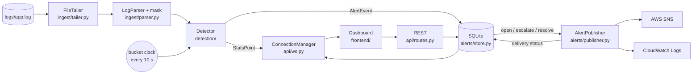

# Architecture

ClaimsWatch is a single Python process (FastAPI + asyncio) next to the service
it watches, plus a React dashboard. This page describes how data moves through
the backend and the exact messages the dashboard receives.

## Data flow



1. **Tail.** `FileTailer` polls the log file every 250 ms and returns complete
   lines. It copes with partial writes, truncation and rotation.
2. **Parse and mask.** `LogParser` masks PHI in the whole line, then extracts
   timestamp, level, service, message template, source IP and HTTP status.
   Nothing downstream ever sees an unmasked line.
3. **Mine and count.** The detector matches each masked line to a Drain3
   template (`detection/templates.py`), which also yields named parameters
   such as `source_ip`, and adds it to the open 10-second bucket.
4. **Close a bucket.** Every 10 s on the wall clock the pipeline closes the
   bucket, even if no lines arrived. The detector rolls it into the 60 s
   window and runs its detectors. `error_spike` (`detection/error_spike.py`)
   scores each template's error count in the window with the modified
   z-score `0.6745 * (x - median) / MAD` against that template's own rolling
   baseline (`detection/baseline.py`): WARNING at 3.5 (Iglewicz and
   Hoaglin), HIGH at 5, CRITICAL at 8, all configurable, with a MAD floor and
   a minimum-count guard. Findings go to the incident tracker
   (`detection/incidents.py`), which keeps one alert per detector and
   template. The global error rate is scored too, but only for the chart.
5. **Fan out.** The `StatsPoint` goes to every WebSocket client. An incident
   change is saved to SQLite, broadcast, and, when it opens, escalates or
   resolves, queued for AWS delivery.
6. **Deliver.** The publisher sends the alert to SNS and CloudWatch Logs in a
   worker thread, then records the per-channel result on the alert and
   broadcasts it again, so the dashboard shows the SNS message id.

Detection is pure Python with no I/O (`app/detection/` imports nothing from
FastAPI or boto3), which is what lets `tools/replay.py` drive exactly the same
code on a simulated clock.

## REST API

| Method | Path | Returns |
| --- | --- | --- |
| GET | `/api/health` | status, app name, log path, tailer offset, AWS targets, detector timing, pipeline counters (below) |
| GET | `/health` | `{"status": "ok"}`, a dependency-free liveness probe for containers |
| GET | `/api/stats?minutes=10` | `{"points": [StatsPoint, ...]}`, oldest first |
| GET | `/api/alerts?limit=50` | `{"alerts": [Alert, ...]}`, newest first by `opened_at` |
| POST | `/api/alerts/{id}/ack` | the updated `Alert` (`acknowledged: true`), 404 if unknown |

Interactive docs are served at `http://localhost:8000/docs`.

### Health

```json
{
  "status": "ok",
  "app": "ClaimsWatch",
  "log_path": "logs/app.log",
  "tailer_offset": 1889389,
  "aws": {
    "sns_topic_arn": "arn:aws:sns:us-east-1:123456789012:claimswatch-alerts",
    "cloudwatch_log_group": "/claimswatch/alerts",
    "endpoint": "http://localhost:5000"
  },
  "detector": {"window_seconds": 60, "bucket_seconds": 10, "baseline_min_buckets": 6,
               "detectors": ["error_spike"]},
  "learning": {"state": "ready", "buckets_seen": 30, "buckets_needed": 6, "templates": 16},
  "pipeline": {"parsed_lines": 5013, "malformed_lines": 0, "baseline_warm": true, "websocket_clients": 1}
}
```

- `aws`: all `null` when delivery is disabled; `endpoint` is `null` for real AWS.
- `detector`: the timing the dashboard uses to label the chart and the
  baseline warm-up (one full window, then `baseline_min_buckets` samples),
  and `detectors`, the detectors this build runs.
- `learning`: warm-up progress (`buckets_seen` learned windows out of
  `buckets_needed`) and `templates`, the distinct Drain3 templates seen so far.
- `pipeline`: counters for troubleshooting: lines parsed and skipped as
  malformed since startup, whether the baseline is warm, and how many
  WebSocket clients are connected.

## WebSocket `/ws`

Server to client only. Every message is:

```json
{"type": "stats" | "alert", "data": { ... }}
```

- `stats`: one per closed 10-second bucket; `data` is a StatsPoint.
- `alert`: whenever an incident opens, updates, escalates, resolves, is
  acknowledged, or its AWS delivery status changes; `data` is the full Alert.
  Clients upsert by `id`.

### StatsPoint

```json
{
  "ts": "2026-09-28T13:05:10Z",
  "total": 412,
  "errors": 9,
  "error_rate": 0.0218,
  "baseline_median": 0.019,
  "band_upper": 0.031,
  "score": 0.8,
  "severity": null,
  "learning": {"state": "ready", "buckets_seen": 30, "buckets_needed": 6, "templates": 16}
}
```

`total`, `errors` and `error_rate` cover the 60 s window ending at `ts`.
When the window held no lines at all, `error_rate` and `score` are `null`
(the rate is undefined, not 0%) and the dashboard draws a gap.
`baseline_median`, `band_upper` (the error rate at which the score reaches the
WARNING threshold) and `score` are `null` until the baseline is warm.
`severity` is `null`, `"WARNING"`, `"HIGH"` or `"CRITICAL"`: the highest
severity any detector reported for this bucket. `baseline_median`,
`band_upper` and `score` describe the global error rate (the chart and the
benchmark control); alerts come from the per-template detectors.

### Alert

```json
{
  "id": "a3f9c2e1",
  "status": "open",
  "severity": "CRITICAL",
  "score": 9.4,
  "error_rate": 0.31,
  "baseline_median": 0.02,
  "opened_at": "2026-09-28T13:05:10Z",
  "updated_at": "2026-09-28T13:05:40Z",
  "resolved_at": null,
  "summary": "94% of errors come from claim-adjudication: DB connection timeout",
  "top_contributors": {
    "services": [{"value": "claim-adjudication", "count": 212, "share": 0.94}],
    "messages": [{"value": "DB connection timeout", "count": 200, "share": 0.89}],
    "source_ips": [{"value": "10.4.2.17", "count": 3, "share": 0.01}]
  },
  "sample_lines": ["2026-09-28T13:05:03.112Z ERROR claim-adjudication msg=\"DB connection timeout\" member_id=<MEMBER_ID> ..."],
  "acknowledged": false,
  "delivery": {
    "sns": {"status": "sent", "message_id": "5f1c...", "error": null},
    "cloudwatch": {"status": "sent", "error": null}
  },
  "detector": "error_spike",
  "template": {
    "id": "18",
    "text": "ERROR member-auth msg=\"login failed: invalid credentials\" <*> member_id=<MEMBER_ID> name=\"<NAME>\" <*> email=<EMAIL> ip=<IP> status=401 <*>",
    "service": "member-auth"
  },
  "baseline_band": {"median": 0.0, "upper": 5.189, "unit": "errors/60s"},
  "observed": 179.0,
  "first_bad_line": "2026-09-28T09:14:00.949Z ERROR member-auth msg=\"login failed: invalid credentials\" ... ip=10.4.2.17 status=401 latency_ms=20",
  "params": [{"name": "source_ip", "value": "10.4.2.17", "count": 179, "share": 1.0}]
}
```

`severity`, `score`, `error_rate`, `baseline_median`, `summary`,
`top_contributors`, `sample_lines` and the explanation fields (`template`,
`baseline_band`, `observed`, `params`) describe the incident at its peak;
`first_bad_line` is the masked line at which the count first crossed the
band. `score` is the alerting detector's modified z-score; `error_rate` and
`baseline_median` are the global window rate and its median, as in v1.
`params` lists template parameter values behind at least half of the
template's lines. The explanation fields are `null` (or `[]`) on alerts
stored before they existed.
Delivery status is one of `pending`, `sent`, `failed` or `disabled`.

## Persistence

Alerts are stored in SQLite (`DB_PATH`, default `claimswatch.db`), one row per
incident with JSON columns for contributors, sample lines, delivery and the
explanation. Columns added after the first release are nullable and created
with `ALTER TABLE` on start-up, so an existing database is migrated in place. Stats
points are kept in memory for the last hour; they are cheap to regenerate and
only feed the chart.
